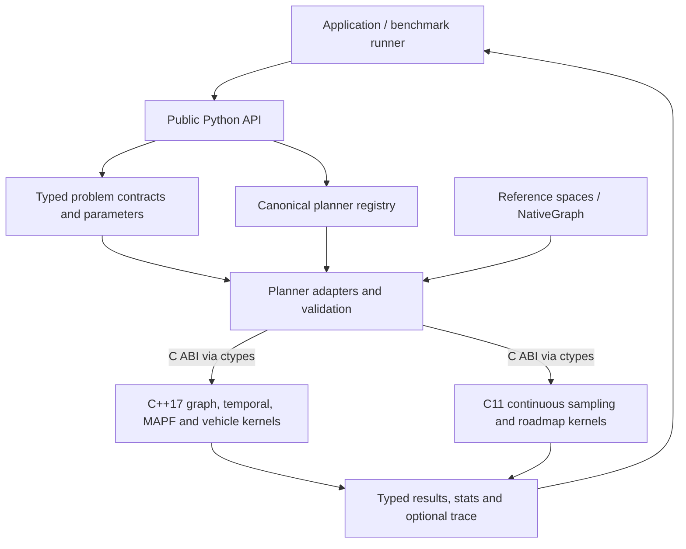
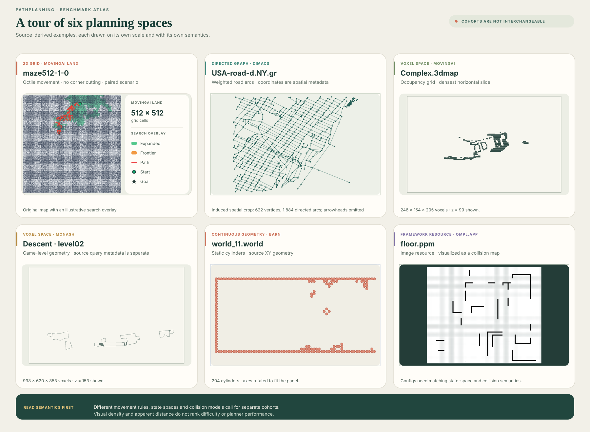
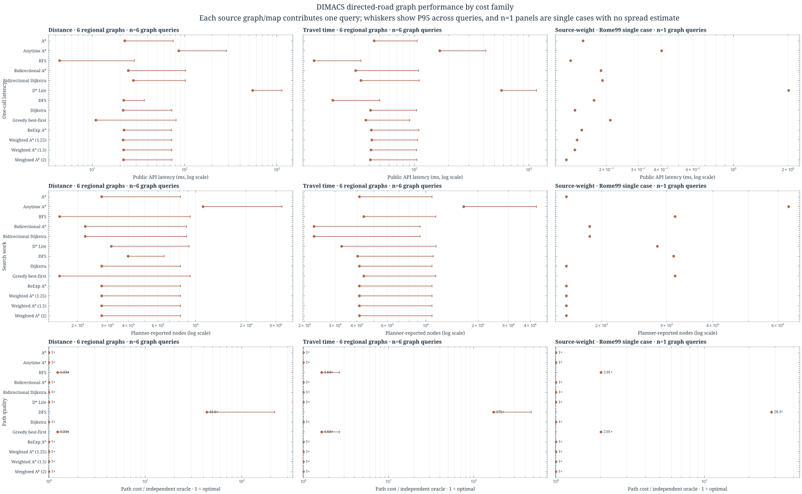
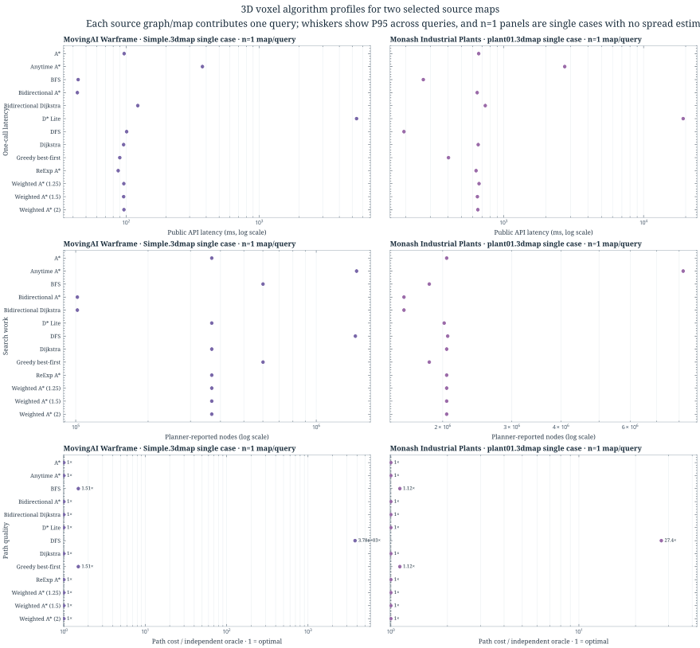
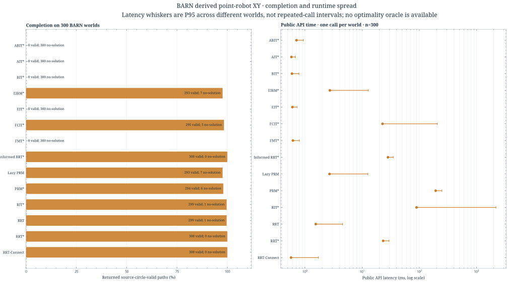

# PathPlanning

PathPlanning is a typed Python toolkit for discrete, continuous, temporal, and
multi-agent planning. It provides 37 registered planners, reference spaces,
native C/C++ search engines, and optional visualization.

## At a glance

- Package: `pathplanning` 0.2.0; Python `>=3.10`; NumPy is the only required
  runtime dependency.
- Planner support is defined by the canonical
  [`PLANNER_REGISTRY`](pathplanning/registry.py) and generated
  [supported-planner matrix](SUPPORTED_ALGORITHMS.md): 15 discrete, 17
  continuous, 3 temporal, and 2 multi-agent planners.
- Native graph, temporal, multi-agent, and vehicle search uses C++; continuous
  sampling and roadmap kernels use C. Python supplies the public API, contracts,
  validation, and adapters through a versioned C ABI.
- The local benchmark catalog contains 1,297 dataset entries and 2,627 assets
  from DIMACS, BARN, MovingAI, Monash, and OMPL. Installation, runner support,
  and completed measurements are tracked separately below.

## Architecture



| Layer | Main files | Role |
|---|---|---|
| Public API | [`pathplanning/api.py`](pathplanning/api.py), [`pathplanning/__init__.py`](pathplanning/__init__.py) | `plan()` and the four problem-specific entry points validate inputs and dispatch a named planner. |
| Contracts and results | [`pathplanning/core/`](pathplanning/core/) | Defines problem protocols, typed parameters, `PlanResult` variants, stop reasons, and trace options. |
| Registry | [`pathplanning/registry.py`](pathplanning/registry.py) | Single source of truth for the 37 registered planner IDs, problem kinds, callables, and restrictions. |
| Spaces and geometry | [`pathplanning/spaces/`](pathplanning/spaces/), [`pathplanning/geometry/`](pathplanning/geometry/) | Supplies grid, voxel, continuous, terrain, manipulator, and vehicle models plus reusable motion geometry. |
| Planner adapters | [`pathplanning/planners/`](pathplanning/planners/) | Groups discrete search, continuous sampling, kinodynamic, temporal, and multi-agent implementations. |
| Native runtime | [`pathplanning/native/`](pathplanning/native/) | Owns search state and hot loops; Python crosses the C ABI through `ctypes`. Discrete Python graphs are prepared as CSR before the C++ search loop. |
| Tools and docs | [`scripts/`](scripts/), [`tests/`](tests/), [`docs/`](docs/) | Dataset installation, benchmark runners, validation, examples, API contracts, and architecture references. |

The C++ layer contains general graph search plus specialized grid kernels,
temporal safe-interval search, multi-agent search, and SE(2) vehicle search.
Continuous sampling planners and reusable PRM-family roadmaps execute in the C
engine. Built-in spaces and spaces that provide a `NativeContinuousSpaceModel`
run without Python callbacks; callback compatibility is an explicit opt-in.
`DynamicRRT3D` is a stateful Python-facing API backed by the native C engine,
but it is outside the planner registry.

For implementation boundaries, memory ownership, build steps, callback behavior,
and the production/trace library split, see [Native Planning Core](docs/native_core.md)
and the [native ABI contract](docs/native_abi.md).

## Problem contracts and reference spaces

| Problem kind | Contract | Reference inputs and models |
|---|---|---|
| Discrete | `DiscreteProblem`: graph, start, exact goal or goal test | `NativeGraph`, `Grid2DSearchSpace`, `TerrainCostGrid2D`, `Grid3DSearchSpace` |
| Continuous | `ContinuousProblem`: state space, start, goal region, optional objective | `ContinuousSpace3D`, `Grid2DSamplingSpace`, `AnisotropicContinuousSpace`, `PlanarManipulatorSpace` |
| Temporal | `TemporalProblem`: graph plus half-open blocked node/edge intervals and travel times | SIPP variants; waiting is supported under each planner's motion contract |
| Multi-agent | `MultiAgentProblem`: undirected unit-time graph and start/goal sets | EECBS and LaCAM* with vertex and edge-swap conflict rules |

`hybrid_astar` and `state_lattice` use the continuous API with specialized SE(2)
vehicle models (`AckermannGridSpace` and `StateLatticeGridSpace`). A planner's
registration does not imply compatibility with every space: goal, metric,
motion, cost, and callback requirements are listed in the
[planner matrix](SUPPORTED_ALGORITHMS.md).

## Installed planner inventory

These are the 37 planner IDs currently registered as supported API entry points.
The full matrix includes module names and planner-specific preconditions.

| Family | Count | Planner IDs |
|---|---:|---|
| Discrete graph and grid search | 15 | `bfs`, `dfs`, `greedy_best_first`, `astar`, `bidirectional_dijkstra`, `bidirectional_astar`, `dijkstra`, `dstar_lite`, `weighted_astar`, `reexp_astar`, `anytime_astar`, `jps`, `jpsw`, `theta_star`, `lazy_theta_star` |
| Continuous sampling and roadmaps | 15 | `rrt`, `rrt_star`, `informed_rrt_star`, `fmt_star`, `prm_star`, `lazy_prm`, `ait_star`, `eit_star`, `eirm_star`, `fcit_star`, `rit_star`, `jit_star`, `bit_star`, `abit_star`, `rrt_connect` |
| Continuous kinodynamic / vehicle | 2 | `hybrid_astar`, `state_lattice` |
| Temporal graph search | 3 | `sipp`, `bounded_suboptimal_sipp`, `kinodynamic_sipp` |
| Multi-agent path finding | 2 | `eecbs`, `lacam_star` |

`DynamicRRT3D` is an additional stateful API, not a registry entry. Reusable
state is also exposed by D* Lite and the PRM*, Lazy PRM, and EIRM* roadmap APIs.
See the [algorithm guides](docs/algorithms/) and
[`SUPPORTED_ALGORITHMS.md`](SUPPORTED_ALGORITHMS.md) for constraints and usage.

## Benchmark dataset inventory

The installer stores data and its provenance catalog under the ignored local
directory `benchmark-results/datasets/`. The table distinguishes catalog size,
installed files, compatible runner coverage, and source limitations; catalog
entries are not independent geometries.

<p align="center">
  
</p>

| Source | Entries / files | Data represented | Current runner and measurement coverage |
|---|---:|---|---|
| DIMACS | 25 / 37 | Directed weighted road graphs; 12 distance/time graph pairs plus Rome99, with 12 shared coordinate files. | 13 graphs measured: six distance, six travel-time, and one source-weight graph. Twelve graphs exceed configured resource limits. |
| BARN | 300 / 600 | 300 static cylinder worlds and 300 supplied `.npy` paths. | All 300 worlds run as a derived point-robot XY cohort. Supplied paths are provenance only; no independent continuous optimality oracle is available. |
| MovingAI | 853 / 1,706 | 789 2D land maps, 20 terrain maps, 44 voxel maps, and their scenarios. | All 789 land maps are covered. Terrain awaits its original cost table; one voxel map ran and 43 exceeded current resource limits. |
| Monash | 90 / 179 | 90 voxel maps and 89 linked scenarios across Descent, Sandstone, Industrial Plants, and Warframe. | 44 Warframe maps mirror an older MovingAI release. One distinct map ran; 45 are resource-limited. `level27.3dmap` has no source-linked scenario. |
| OMPL / OMPL.app | 29 / 105 | 25 OMPL.app configurations and four geometric demo definitions, with the referenced resources needed by the demos. | Files are installed and registered. No OMPL, Gazebo, or ROS runtime is bundled, so these resources have no planner measurements yet. |
| **Total** | **1,297 / 2,627** | Five source collections with recorded lineage and SHA-256 metadata. | All 2,627 assets passed the recorded installation hash/completeness verification; the Monash missing-scenario source gap remains explicit. |

MovingAI land, terrain, and voxel maps stay in separate directories and use
different semantics. DIMACS cost units, strict 26-neighbor voxel movement, BARN
point-robot XY geometry, and OMPL configuration-space problems are also kept in
separate benchmark cohorts. See the [dataset installation guide](docs/benchmarks/dataset_installation.md)
for file layout and commands, and [dataset characterization](docs/benchmarks/dataset_characterization.md)
for topology, lineage, bias controls, and unsupported measurements.

## MovingAI Scenario Gallery

These scenes use real map and start/goal pairs from the
[Moving AI 2D benchmark collection](https://movingai.com/benchmarks/grids.html).
Each image shows one matrix, the MovingAI scenario's endpoints, an algorithm's
route, and its explored/frontier cells. The examples cover maze, room, DAO,
street, and StarCraft map families under the `land_octile_v1` movement rules.

The gallery chooses a median path-length A* scenario from each family's saved
work-pass cohort, then replays the named planner with a bounded diagnostic trace
to draw its search state. Those trace runs create these illustrations only; the
benchmark's latency figures come from separate production runs with tracing and
metrics instrumentation disabled. See the
[scenario and benchmark reproduction steps](docs/shortest_path_benchmark_reproduction.md).

<p align="center">
  
  
</p>
<p align="center">
  
  
</p>
<p align="center">
  
</p>

For interactive traces, custom scenes, and the rendering API, see the
[visualization guide](docs/visualization.md).

## Latest benchmark results

Results below are from the 2026-10-10 refresh. Each cohort uses its own task,
movement, cost, and collision model; the counts and figures are not a pooled
planner ranking.

| Cohort | Completed coverage | Result and limit |
|---|---:|---|
| MovingAI land | 789 maps; 3,363 reachable work queries × 12 variants; separate latency (788 queries) and memory (30 queries) cohorts | All 40,356 work observations returned valid paths without runner errors. A separate 2,160-query unreachable cohort across 180 maps was correctly classified by all 12 variants. |
| MovingAI grid specialists | 788 map/query pairs × 4 planners | JPS was optimal on 788; D* Lite was optimal on 750 and resource-limited on 38; Theta* and Lazy Theta* returned valid any-angle paths on all 788. |
| Scaling | 1,600 work queries × 17 variants; separate latency (400 queries) and memory (80 queries) cohorts | All 17 variants solved 1,538 reachable queries and correctly classified 62 unreachable queries; size, density, and corridor-topology cohorts retain their own memberships. |
| DIMACS roads | 13 of 25 directed graphs × 13 variants | The selected cohort covers six distance, six travel-time, and one source-weight graph; the other 12 graphs exceed configured resource limits. Road costs and grid costs are not pooled. |
| MovingAI and Monash voxels | 2 distinct maps × 13 variants | 20 optimal and 6 valid suboptimal results under the strict 26-neighbor oracle; mirrors and resource-limited maps remain visible in inventory. |
| BARN | 300 worlds × 14 compatible planners | 2,673 returned paths passed source-geometry validation; 1,527 runs ended with `no_solution_found`. No invalid paths or planner errors. |
| OMPL.app and terrain | Installed and registered | OMPL requires its matching collision/state-space runtime; terrain remains unsupported while the original cost table is unavailable. |

The 2026-10-10 refresh recorded 216,535 measurement entries across the
MovingAI land, scaling, unreachable, grid-specialist, DIMACS, voxel, and BARN
cohorts, including warm-up runs and separate work, latency, and memory passes.
All 37 planner IDs in the [supported planner registry](SUPPORTED_ALGORITHMS.md)
have measured results: dataset-scale results where the source task matches,
and separately labeled smoke results for temporal, multi-agent, vehicle, and
other unsupported source-task contracts. Smoke-only references are excluded
from the 2026-10-10 refresh total. The tables below keep each task model and
measurement protocol separate instead of combining them into a ranking.
Timing observations in the refresh were collected on an Apple M2 Max running
macOS 27.0.1 and Python 3.14.8; interpret timings within that host and protocol.

<details>
<summary>MovingAI land and scaling results for all 17 search variants</summary>

The 2026-10-10 refresh covers 3,363 solvable MovingAI map/query pairs in the
work pass; all 12 variants returned valid paths on every pair, with no errors,
timeouts, or inconsistent results. The separate latency pass covers 788
solvable map/query identities, using two warm-ups and five measured repeats
per variant. Scaling work covers 1,538 solvable and 62 unreachable tasks; all
17 variants solved the 1,538 and classified all 62 unreachable tasks
correctly. Scaling latency covers 386 solvable identities from a separate
400-task cohort, also with two warm-ups and five measured repeats. The cost
ratios and latency percentiles below are descriptive aggregates over their
frozen cohorts, not universal planner ranks.

| Variant | MovingAI optimal / 3,363; mean cost ratio | MovingAI median / P95 ms | Scaling optimal / 1,538; mean cost ratio | Scaling median / P95 ms |
|---|---:|---:|---:|---:|
| `anytime_astar` | 3,363; 1.000 | 2.214 / 48.115 | 1,538; 1.000 | 5.502 / 89.723 |
| `astar` | 3,363; 1.000 | 1.374 / 19.965 | 1,538; 1.000 | 4.323 / 29.672 |
| `astar_halpha_0` | — | — | 1,538; 1.000 | 10.711 / 30.380 |
| `astar_halpha_0.25` | — | — | 1,538; 1.000 | 9.349 / 29.200 |
| `astar_halpha_0.5` | — | — | 1,538; 1.000 | 8.817 / 31.462 |
| `astar_halpha_0.75` | — | — | 1,538; 1.000 | 6.762 / 24.664 |
| `astar_halpha_1` | — | — | 1,538; 1.000 | 4.308 / 29.736 |
| `bidirectional_astar` | 3,363; 1.000 | 4.287 / 35.832 | 1,538; 1.000 | 13.114 / 43.055 |
| `bidirectional_dijkstra` | 3,363; 1.000 | 1.805 / 22.188 | 1,538; 1.000 | 10.679 / 25.411 |
| `breadth_first_search` (`bfs`) | 447; 1.077 | 0.503 / 6.503 | 169; 1.038 | 3.605 / 9.491 |
| `depth_first_search` (`dfs`) | 85; 48.753 | 1.094 / 8.952 | 1; 56.935 | 3.942 / 17.875 |
| `dijkstra` | 3,363; 1.000 | 1.841 / 26.555 | 1,538; 1.000 | 9.407 / 29.047 |
| `greedy_best_first` | 684; 1.165 | 0.675 / 4.286 | 248; 1.112 | 0.838 / 16.318 |
| `reexp_astar` | 3,363; 1.000 | 1.208 / 14.652 | 1,538; 1.000 | 3.371 / 23.672 |
| `weighted_astar` (`w=1.25`) | 1,098; 1.017 | 0.806 / 13.099 | 502; 1.025 | 0.945 / 24.451 |
| `weighted_astar` (`w=1.5`) | 962; 1.028 | 0.763 / 11.571 | 461; 1.039 | 0.902 / 24.817 |
| `weighted_astar` (`w=2`) | 883; 1.042 | 0.731 / 10.156 | 440; 1.055 | 0.868 / 24.877 |

The 17 scaling variants include five `astar_halpha_*` settings that were not
part of the 12-variant MovingAI work and latency passes. Latency is the
per-query median across repeats, then summarized by the median and P95 across
the eligible query identities. The 2,160-query MovingAI unreachable check
across 180 maps is a separate correctness cohort and is not included in these
latency figures.
</details>

<details>
<summary>DIMACS and voxel outcomes split by cost and source cohort</summary>

Each of the 13 listed variants ran one seeded query per selected graph or map.
Cells show valid paths / oracle-optimal paths. DIMACS cost families and the two
voxel source maps stay separate. Twelve of the 25 DIMACS source graphs exceeded
the configured resource limits. Voxel optimality uses the strict 26-neighbor
Euclidean oracle.

| Variant | Distance (6 graphs) | Travel time (6 graphs) | Rome99 source-weight (1 graph) | Warframe `Simple.3dmap` | Industrial `plant01.3dmap` |
|---|---:|---:|---:|---:|---:|
| `anytime_astar` | 6 / 6 | 6 / 6 | 1 / 1 | 1 / 1 | 1 / 1 |
| `astar` | 6 / 6 | 6 / 6 | 1 / 1 | 1 / 1 | 1 / 1 |
| `bfs` | 6 / 0 | 6 / 0 | 1 / 0 | 1 / 0 | 1 / 0 |
| `bidirectional_astar` | 6 / 6 | 6 / 6 | 1 / 1 | 1 / 1 | 1 / 1 |
| `bidirectional_dijkstra` | 6 / 6 | 6 / 6 | 1 / 1 | 1 / 1 | 1 / 1 |
| `dfs` | 6 / 0 | 6 / 0 | 1 / 0 | 1 / 0 | 1 / 0 |
| `dijkstra` | 6 / 6 | 6 / 6 | 1 / 1 | 1 / 1 | 1 / 1 |
| `dstar_lite` | 6 / 6 | 6 / 6 | 1 / 1 | 1 / 1 | 1 / 1 |
| `greedy_best_first` | 6 / 0 | 6 / 0 | 1 / 0 | 1 / 0 | 1 / 0 |
| `reexp_astar` | 6 / 6 | 6 / 6 | 1 / 1 | 1 / 1 | 1 / 1 |
| `weighted_astar` (`w=1.25`) | 6 / 6 | 6 / 6 | 1 / 1 | 1 / 1 | 1 / 1 |
| `weighted_astar` (`w=1.5`) | 6 / 6 | 6 / 6 | 1 / 1 | 1 / 1 | 1 / 1 |
| `weighted_astar` (`w=2`) | 6 / 6 | 6 / 6 | 1 / 1 | 1 / 1 | 1 / 1 |

<small>Counts are valid / optimal, not runtime ranks. Parallel road arcs are
coalesced by minimum cost per ordered pair; a zero heuristic is used because
road-coordinate units are not assumed to match edge-cost units. The n=1
Rome99 and voxel columns are single-case correctness results.</small>
</details>

<details>
<summary>MovingAI grid-specialist results</summary>

| Planner | Coverage | Result |
|---|---:|---|
| `jps` | 788 map/query pairs | 788/788 oracle-optimal paths |
| `dstar_lite` | 788 map/query pairs | 750 optimal; 38 resource-limited |
| `theta_star` | 788 map/query pairs | 788/788 valid any-angle paths; not scored against the grid-optimal cost |
| `lazy_theta_star` | 788 map/query pairs | 788/788 valid any-angle paths; not scored against the grid-optimal cost |

The MovingAI terrain assets remain outside these runs because the source
terrain cost table is missing; `jpsw` therefore has only the separate
10-workload smoke result below.
</details>

<details>
<summary>BARN point-robot XY results for all 14 compatible continuous planners</summary>

Each planner ran once on each of 300 derived static point-robot XY worlds.
The table gives returned source-geometry-valid paths / 300 and public API time
across the 300 worlds; a `no_solution_found` outcome is not counted as a path.
The P95 is workload spread across different worlds, not repeated-call latency.
All 2,673 returned paths passed exact source-circle validation, with zero
invalid paths or runner errors. This cohort has no independent continuous
optimality oracle, so it supports path-validity and completion analysis rather
than optimality claims or a cross-planner speed ranking. The source `.npy`
paths remain provenance only; they are not XY paths in the supplied world
coordinates.

| Planner | Valid paths / 300 | Median API ms | P95 API ms across worlds |
|---|---:|---:|---:|
| `abit_star` | 0 | 0.710 | 0.936 |
| `ait_star` | 0 | 0.581 | 0.677 |
| `bit_star` | 0 | 0.592 | 0.786 |
| `eirm_star` | 293 | 2.726 | 12.790 |
| `eit_star` | 0 | 0.604 | 0.727 |
| `fcit_star` | 295 | 22.655 | 206.166 |
| `fmt_star` | 0 | 0.616 | 0.800 |
| `informed_rrt_star` | 300 | 28.247 | 34.977 |
| `lazy_prm` | 293 | 2.690 | 12.589 |
| `prm_star` | 294 | 192.799 | 247.685 |
| `rit_star` | 299 | 89.164 | 2,182.312 |
| `rrt` | 299 | 1.544 | 4.539 |
| `rrt_connect` | 300 | 0.571 | 1.714 |
| `rrt_star` | 300 | 23.268 | 29.474 |

`jit_star` is excluded from BARN because this point-robot model does not
provide the robot Jacobian required for manipulability scoring.
</details>

<details>
<summary>Smoke-only measurements for the remaining task contracts</summary>

These are one-run reference checks with fixed seeds and no warm-up, not
dataset-scale results or statistically stable rankings. Timing values across
different task contracts are not comparable.

| Planner | Result | Smoke workload |
|---|---|---|
| `jpsw` | 10/10 successful; 77.820 ms median API | 10-family MovingAI smoke; source terrain costs unavailable |
| `sipp` | 1/1; 0.146 ms; arrival 4, cost 4 | Temporal reference case |
| `bounded_suboptimal_sipp` | 1/1; 0.077 ms; arrival 4, cost 4 | Temporal reference case |
| `kinodynamic_sipp` | 1/1; 0.080 ms; arrival 6, cost 6 | Kinodynamic temporal reference case |
| `eecbs` | 1/1; 0.130 ms; sum of costs 4, makespan 2 | Multi-agent reference case |
| `lacam_star` | 1/1; 0.087 ms; sum of costs 4, makespan 2 | Multi-agent reference case |
| `hybrid_astar` | 1/1; 0.223 ms; cost 13.894 | Vehicle reference case |
| `state_lattice` | 1/1; 0.179 ms; cost 3 | Vehicle reference case |
| `jit_star` | 1/1; 492.546 ms; 45 nodes | Jacobian-enabled continuous reference case |

Temporal, multi-agent, and vehicle planners have no matching source tasks in
the installed static single-agent datasets. `jit_star` has a reference result,
but is not compatible with the BARN point-robot model.
</details>

For provenance, dataset exclusions, bias controls, and reproduction commands,
see the [dataset installation guide](docs/benchmarks/dataset_installation.md),
[dataset semantics and bias controls](docs/benchmarks/dataset_characterization.md),
and [campaign reproduction guide](docs/shortest_path_benchmark_reproduction.md).

## Benchmark figures

These figures use the 2026-10-10 refreshed complete cohorts. They cover every
dataset-scale algorithm/dataset pairing that currently has a compatible
runner: MovingAI land, generated scaling
grids, grid specialists, DIMACS graph subtypes, both distinct voxel sources,
and BARN point-robot worlds. The format cohorts keep their own cost, movement,
and collision semantics; do not compare values across panels as one leaderboard.
The benchmark charts use Matplotlib with the SciencePlots `science` style and
LaTeX rendering disabled.

The latency figures separate repeated public-API calls from one-call-per-query
results. Repeated cohorts show the median of five calls per query, then the
median and P95 across query identities; one-call cohorts show the spread across
source instances. A one-instance DIMACS or voxel panel is a case measurement,
not an estimate of performance across that dataset. Work and path-cost figures
use only the compatible 2D octile cohorts. The mean path-cost ratio uses a
logarithmic axis because DFS averages 48.8× and 56.9× the oracle cost on the two
cohorts; this keeps those outliers visible while preserving differences near
1.0. Outcome shares are calculated within each compatible cohort, and the
all-planner unreachable proof is reported as a separate completeness check.
For BARN, `no_solution_found` is a planner outcome and does not mean an invalid
returned path. Memory separates instrumented per-query workspace from total
fresh-worker RSS, which also includes Python, map loading, and graph setup.

<p align="center">
  
</p>
<p align="center">
  
</p>
<p align="center">
  
</p>
<p align="center">
  
</p>
<p align="center">
  
</p>
<p align="center">
  
</p>
<p align="center">
  
</p>

Terrain and OMPL remain unmeasured because the source terrain cost table and
matching OMPL collision/state-space runtime are unavailable. Temporal,
multi-agent, kinodynamic, and vehicle planners retain their separately labeled
smoke references because the installed static datasets do not contain matching
source tasks. The [reproduction guide](docs/shortest_path_benchmark_reproduction.md)
records the refresh commands and measurement boundaries.

### Non-grid cohorts

The non-grid profiles below use metrics appropriate to each source. DIMACS
distance and travel-time costs are analyzed in separate panels; each has six
selected regional graphs, while Rome99 is a one-graph case. Points and P95
whiskers summarize one seeded query per graph, so they describe graph-to-graph
spread rather than repeated-call latency. The voxel panels show one selected
MovingAI Warframe and one Monash Industrial Plants map, each with one query;
their points are case measurements with no dataset-level spread estimate.
BARN uses 300 derived point-robot XY worlds per planner and shows collision-
valid path completion beside one-call latency spread across worlds. Its paths
are geometry-validated, but there is no independent optimality oracle, so no
path-cost ratio is reported. OMPL.app remains outside measured figures until
the matching collision and state-space runtime is available.

<p align="center">
  
</p>
<p align="center">
  
</p>
<p align="center">
  
</p>

## Installation

```bash
git clone https://github.com/damminhtien/pathplanning.git
cd pathplanning

python -m venv .venv
source .venv/bin/activate
pip install --upgrade pip
pip install .
```

Python `>=3.10`, a C11 compiler, and a C++17 compiler are required when building
from source. Graph, temporal, multi-agent, and vehicle kernels run in C++;
continuous sampling and roadmap kernels run in C.
Install the optional viewer and plotting dependencies with `pip install -e ".[viz]"`.

### Install the benchmark datasets

Dataset assets are separate from the Python package and remain under the local,
Git-ignored `benchmark-results/datasets/` directory. After installing the
package dependencies, install and check the catalog with:

```bash
python scripts/install_benchmark_datasets.py install
python scripts/install_benchmark_datasets.py status
python scripts/install_benchmark_datasets.py verify
```

See the [dataset installation guide](docs/benchmarks/dataset_installation.md)
for catalog selection, storage limits, source attribution, and MovingAI
benchmark preparation. Dataset installation does not itself run planners.

## Package API

Minimal import-first usage:

```python
from pathplanning import RrtParams, plan_continuous
from pathplanning.core.contracts import ContinuousProblem, GoalState
from pathplanning.spaces.continuous_3d import ContinuousSpace3D

space = ContinuousSpace3D(lower_bound=[0, 0, 0], upper_bound=[10, 10, 10])
params = RrtParams(max_iters=2_000, step_size=0.6, goal_sample_rate=0.1)
problem = ContinuousProblem(
    space=space,
    start=[1.0, 1.0, 1.0],
    goal=GoalState(state=[9.0, 9.0, 1.0], radius=0.5, distance_fn=space.distance),
)

result = plan_continuous(
    problem,
    planner="rrt",
    params=params,
    seed=7,
)

print(result.success, result.stop_reason, result.path)
```

Single public API for both planner families:

```python
from pathplanning.api import plan_discrete
from pathplanning.core.contracts import DiscreteProblem
from pathplanning.spaces.grid2d import Grid2DSearchSpace

problem = DiscreteProblem(
    graph=Grid2DSearchSpace(),
    start=(5, 5),
    goal=(45, 25),
)
result = plan_discrete(problem, planner="astar", seed=0)
print(result.success, result.iters)
```

### Native models for custom spaces

A custom space can avoid Python callbacks by exposing native bounds and
supported obstacle arrays through `to_native_model()`:

```python
from pathplanning.native import NativeContinuousSpaceModel


class UnitLineSpace:
    def to_native_model(self) -> NativeContinuousSpaceModel:
        return NativeContinuousSpaceModel(lower_bounds=[0.0], upper_bounds=[1.0])
```

The native model must match the space's sampling, distance, steering, and
collision semantics. Otherwise, use the planner-specific callback opt-in.
See [Native Planning Core](docs/native_core.md) for supported models and
[Native ABI](docs/native_abi.md) for ownership and error behavior.

For inconsistent heuristics, `reexp_astar` exposes Weighted A* with conditional
closed-node re-expansion. Its parameters follow ReExpAstar: `weight`, `r`,
`r_mode` (`abs`, `rel_edge`, or `rel_g`), and `tie_break` (`g_low` or
`g_high`). `r=0` always reopens improved closed nodes; `r=float("inf")` never
reopens them. `max_runtime_ms` and `max_expansions` bound a search.

```python
result = plan_discrete(
    problem,
    planner="reexp_astar",
    params={"weight": 1.5, "r": 0.2, "r_mode": "abs"},
)
print(result.success, result.stats.get("reopens", 0.0))
```

For uniform-cost 8-connected occupancy grids with corner cutting disabled,
`jps` compresses straight and diagonal runs into jump-point expansions while
returning the full cell path. See the [JPS contract and runnable example](docs/algorithms/jps.md).

For weighted 8-connected terrain grids, `jpsw` applies Weighted Jump Point
Search to positive per-cell costs and returns the full traversed-cell path.
Construct a `TerrainCostGrid2D` to use its cardinal and diagonal cell-integral
cost model; see the [JPSW contract and runnable example](docs/algorithms/jpsw.md).

For any-angle paths on 8-connected grids, `theta_star` uses conservative line
of sight and returns cell waypoints joined by validated segments. See the
[Theta* contract and runnable example](docs/algorithms/theta_star.md).

`lazy_theta_star` delays shortcut visibility checks until the node is expanded
and repairs blocked shortcuts through a closed neighboring cell. It shares
Theta*'s conservative corner and terrain-cost rules; see the [Lazy Theta*
contract and runnable example](docs/algorithms/lazy_theta_star.md).

For a fixed goal in a graph whose directed edges can change cost, `dstar_lite`
keeps its search state across calls. Use `DStarLitePlanner` to move the start,
block or reopen existing edges, and repair the route; see the [D* Lite contract
and runnable example](docs/algorithms/dstar_lite.md).

For known time-varying node and edge blocks, `sipp` searches safe intervals
with continuous arrival times and waiting. Pass half-open blocked intervals to
`TemporalProblem`; see the [SIPP contract and runnable example](docs/algorithms/sipp.md).
Use `bounded_suboptimal_sipp` with `params={"w": 1.5}` to trade path optimality
for focal-search guidance while retaining the configured suboptimality bound;
see its [contract and example](docs/algorithms/bounded_suboptimal_sipp.md).
For velocity-state graphs that cannot stop instantaneously, use
`kinodynamic_sipp` with validated motion primitives and explicit speed and
acceleration limits; see its [contract and example](docs/algorithms/kinodynamic_sipp.md).

### Native graph input

Discrete searches run against a C++-owned CSR graph. For repeated queries or
large graphs, initialize it once and reuse it:

```python
from pathplanning.api import plan_discrete
from pathplanning.core.contracts import DiscreteProblem
from pathplanning.native import NativeGraph

graph = NativeGraph.from_edges(
    nodes=[0, 1, 2, 3],
    edges=[(0, 1, 1.0), (0, 2, 4.0), (1, 3, 2.0), (2, 3, 1.0)],
)
problem = DiscreteProblem(graph=graph, start=0, goal=3)
result = plan_discrete(problem, planner="astar")
```

For an exact point goal, the informed sampling planners can be selected through
the same API:

```python
from pathplanning.api import plan_continuous
from pathplanning.core.contracts import ContinuousProblem, GoalState
from pathplanning.spaces.continuous_3d import ContinuousSpace3D

space = ContinuousSpace3D(lower_bound=[0, 0, 0], upper_bound=[10, 10, 10])
problem = ContinuousProblem(
    space=space,
    start=[1.0, 1.0, 1.0],
    goal=GoalState(state=[9.0, 9.0, 1.0]),
    params={"sample_count": 1_000, "batch_size": 100},
)
result = plan_continuous(problem, planner="bit_star", seed=7)
```

`fmt_star`, `bit_star`, `abit_star`, and `informed_rrt_star` optimize additive
path length and reject custom objectives. `bidirectional_astar` requires an
exact goal and a consistent graph heuristic; its native kernel validates the
heuristic on the prepared graph before searching.

`ait_star` combines a reverse cost-to-go search with lazy forward edge
validation. It searches the fixed random geometric graph generated by
`sample_count`; it requires an exact point goal, Euclidean distance, and
additive path length. The [AIT* contract](docs/algorithms/ait_star.md) describes
its finite-graph behavior and guarantee limits.

`eit_star` adds a reverse estimate of collision-check effort and uses it to
break ties between equal path-cost estimates. It shares the fixed-graph and
objective constraints described in the [EIT* contract](docs/algorithms/eit_star.md).

`fcit_star` searches a fully connected informed sample graph with a distributed
edge queue and batched motion checks. It accepts an optional batch motion-check
callback for custom spaces and uses the scalar checker as a fallback; see the
[FCIT* contract](docs/algorithms/fcit_star.md).

`rit_star` optimizes Riemannian arc length under a positive-definite metric
tensor, with anisotropic neighborhoods, cascading edge-cost checks, and optional
CARM updates from collision feedback. Custom metric spaces declare global
eigenvalue bounds and opt into Python callbacks; see the [RIT* contract](docs/algorithms/rit_star.md).

`jit_star` adds bounded ancestor checks and collision-guided sampling to a
native RRT* tree. Robot spaces provide `jacobian(state)` to enable the
manipulability-aware objective and explicitly opt into Python callbacks; see
the [JIT* contract](docs/algorithms/jit_star.md).

`EirmStarRoadmap` keeps a sampled graph and edge-validation results for multiple
queries in one unchanged world. Its per-query search uses remaining collision
effort to break equal-cost path ties; see the [EIRM* contract](docs/algorithms/eirm_star.md).

For repeated continuous-space queries, `PrmStarRoadmap` retains its sampled
roadmap and validates candidate edges during construction. `LazyPrmRoadmap`
defers edge checks until they appear on a candidate route, then caches both
valid and blocked results. Both use `RoadmapParams` and require the caller to
change `world_version` when the world changes; see the [PRM*](docs/algorithms/prm_star.md)
and [Lazy PRM](docs/algorithms/lazy_prm.md) contracts and examples.

For bulk input, pass CSR row offsets, neighbor IDs, and edge costs to
`NativeGraph.from_csr`. This also accepts arrays from a SciPy CSR matrix through
its `indptr`, `indices`, and `data` attributes; SciPy is not required by the
native graph API. No NetworkX conversion is used.

Existing Python graphs that implement `neighbors` and `edge_cost` remain
supported. Their finite reachable graph is copied into CSR once before each
search. Goal predicates and heuristics are evaluated during that preparation;
the C++ search loop does not call Python. The default materialization limit is
1,000,000 nodes and can be changed with
`DiscreteProblem(params={"max_materialized_nodes": ...})`. Use `NativeGraph`
for graphs that exceed that limit or for repeated searches over the same graph.
The built-in 2D and 3D grids pass their valid-node mask and motion set to C++,
which builds their CSR adjacency without Python edge callbacks.

Discrete search results include `graph_init_s` and `native_search_s` stats, and
`elapsed_s` covers graph preparation, native search, and path adaptation. The
two canonical benchmark commands emit the versioned
`pathplanning_benchmark_v1` report with raw per-run observations, summaries,
seed/workload settings, source and native artifact fingerprints, and host
metadata. Use `--output path/to/report.json` to save it atomically or `--json`
to print it. Reports saved under `benchmark-results/` are excluded from source
fingerprints. See [the benchmark contract](docs/benchmark_contract.md) for the
schema and interpretation limits.

## Run Demos

Run from repository root.

```bash
python examples/worlds/custom_grid_world.py
python examples/worlds/demo_3d_world.py
python examples/eecbs.py
python examples/viewer_2d.py
python examples/viewer_3d.py
python scripts/benchmark_planners.py --output benchmark-results/planners.json
python scripts/benchmark_native_sampling.py --output benchmark-results/native-sampling.json
```

## Developer Workflow

Install dev dependencies:

```bash
pip install -r requirements-dev.txt
make build-ext
```

Run checks:

```bash
ruff check .
ruff format --check .
pyright
make test       # fast unit tier (excludes slow integration/packaging checks)
make test-slow  # slow integration/packaging tier
make test-all   # full suite
```

Convenience commands:

```bash
make install-dev
make lint
make typecheck
make test
```

## Typing Policy

Typing is enforced incrementally with `pyright`.

- Global mode: `basic`
- Strict subset:
  - `pathplanning/core`
  - `pathplanning/spaces/continuous_3d.py`
  - `pathplanning/spaces/continuous_nd.py`
  - `pathplanning/spaces/grid2d.py`
  - `pathplanning/nn/index.py`
  - `pathplanning/data_structures/tree_array.py`
  - `pathplanning/planners/sampling/rrt.py`
  - `pathplanning/planners/sampling/rrt_star.py`
  - `pathplanning/api.py`
  - `pathplanning/registry.py`

The package ships `pathplanning/py.typed` (PEP 561).

Details: `docs/typing_policy.md`

## CI

GitHub Actions workflow: `.github/workflows/pylint.yml`

Current CI jobs run:

- `ruff check ...` and `ruff format --check ...`
- `pyright`
- `pytest -q`

## License

See `LICENSE`.
