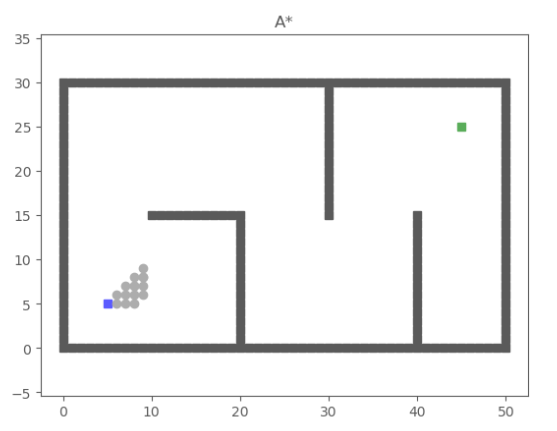
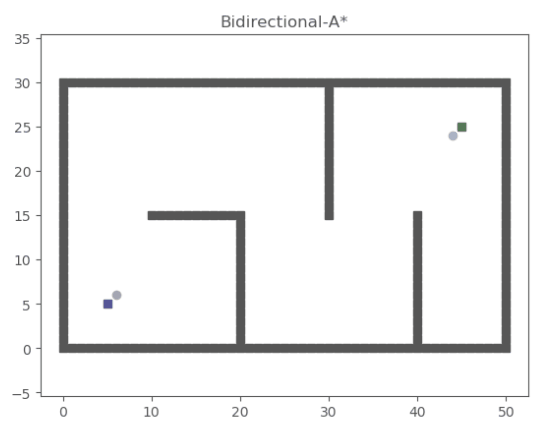
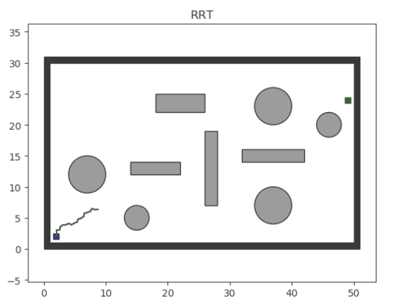
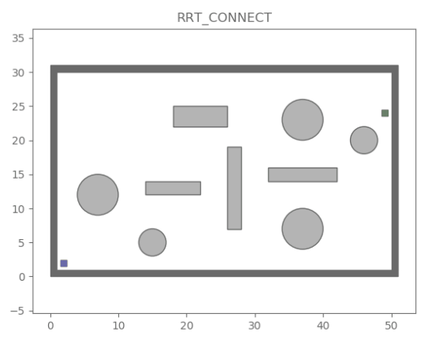

# PathPlanning

PathPlanning is a Python package for search-based and sampling-based path-planning algorithms,
with reusable planner contracts and optional visualization utilities.

## Release

- Package: `pathplanning`
- Version: `0.2.0`
- Canonical repository: `https://github.com/damminhtien/pathplanning`

## Overview

Current codebase organization:

- `pathplanning/native`: C++ discrete-search core exposed through a stable C ABI
- `pathplanning/planners/search`: Python planner wrappers around the native search core
- `pathplanning/planners/sampling`: dimension-agnostic sampling-planner cores
- `pathplanning/spaces`: canonical environment/configuration-space layer
- `pathplanning/nn`: nearest-neighbor index abstractions
- `pathplanning/data_structures`: reusable tree/storage structures
- `pathplanning/utils`: shared utilities (including priority queue)
- `pathplanning/geometry`: geometry and trajectory generation utilities
- `pathplanning/viz`: plotting-only Python helpers with lazy imports

## Repository Layout

```text
.
├── pathplanning/
│   ├── core/
│   ├── planners/
│   │   ├── search/
│   │   └── sampling/
│   ├── spaces/
│   ├── nn/
│   ├── data_structures/
│   ├── utils/
│   ├── geometry/
│   └── viz/
├── tests/
├── docs/
├── assets/
├── scripts/
├── pyproject.toml
└── README.md
```

## Production Support Matrix

Production API support is intentionally small and planner-registry driven.

See `SUPPORTED_ALGORITHMS.md` for the canonical matrix.

The continuous registry provides `rrt`, `rrt_star`, `informed_rrt_star`,
`fmt_star`, `bit_star`, `abit_star`, and `rrt_connect`. The discrete registry
includes native `bidirectional_dijkstra` and `bidirectional_astar`.

## Visual Preview

Animations are stored at:

- `assets/gif/search`
- `assets/gif/sampling`

Example gallery:

<p align="center">
  
  
</p>
<p align="center">
  
  
</p>

## Installation

```bash
git clone https://github.com/damminhtien/pathplanning.git
cd pathplanning

python -m venv .venv
source .venv/bin/activate
pip install --upgrade pip
pip install .
```

Python `>=3.10` and a C++17 compiler are required when building from source.

## Package API

Minimal import-first usage:

```python
from pathplanning import RrtParams, plan_continuous
from pathplanning.core.contracts import ContinuousProblem, GoalState
from pathplanning.spaces.continuous_3d import ContinuousSpace3D

space = ContinuousSpace3D(lower_bound=[0, 0, 0], upper_bound=[10, 10, 10])
params = RrtParams(max_iters=2_000, step_size=0.6, goal_sample_rate=0.1)
problem = ContinuousProblem(
    space=space,
    start=[1.0, 1.0, 1.0],
    goal=GoalState(state=[9.0, 9.0, 1.0], radius=0.5, distance_fn=space.distance),
)

result = plan_continuous(
    problem,
    planner="rrt",
    params=params,
    seed=7,
)

print(result.success, result.stop_reason, result.path)
```

Single public API for both planner families:

```python
from pathplanning.api import plan_discrete
from pathplanning.core.contracts import DiscreteProblem
from pathplanning.spaces.grid2d import Grid2DSearchSpace

problem = DiscreteProblem(
    graph=Grid2DSearchSpace(),
    start=(5, 5),
    goal=(45, 25),
)
result = plan_discrete(problem, planner="astar", seed=0)
print(result.success, result.iters)
```

### Native graph input

Discrete searches run against a C++-owned CSR graph. For repeated queries or
large graphs, initialize it once and reuse it:

```python
from pathplanning.api import plan_discrete
from pathplanning.core.contracts import DiscreteProblem
from pathplanning.native import NativeGraph

graph = NativeGraph.from_edges(
    nodes=[0, 1, 2, 3],
    edges=[(0, 1, 1.0), (0, 2, 4.0), (1, 3, 2.0), (2, 3, 1.0)],
)
problem = DiscreteProblem(graph=graph, start=0, goal=3)
result = plan_discrete(problem, planner="astar")
```

For an exact point goal, the informed sampling planners can be selected through
the same API:

```python
from pathplanning.api import plan_continuous
from pathplanning.core.contracts import ContinuousProblem, GoalState
from pathplanning.spaces.continuous_3d import ContinuousSpace3D

space = ContinuousSpace3D(lower_bound=[0, 0, 0], upper_bound=[10, 10, 10])
problem = ContinuousProblem(
    space=space,
    start=[1.0, 1.0, 1.0],
    goal=GoalState(state=[9.0, 9.0, 1.0]),
    params={"sample_count": 1_000, "batch_size": 100},
)
result = plan_continuous(problem, planner="bit_star", seed=7)
```

`fmt_star`, `bit_star`, `abit_star`, and `informed_rrt_star` optimize additive
path length and reject custom objectives. `bidirectional_astar` requires an
exact goal and a consistent graph heuristic; its native kernel validates the
heuristic on the prepared graph before searching.

For bulk input, pass CSR row offsets, neighbor IDs, and edge costs to
`NativeGraph.from_csr`. This also accepts arrays from a SciPy CSR matrix through
its `indptr`, `indices`, and `data` attributes; SciPy is not required by the
native graph API. No NetworkX conversion is used.

Existing Python graphs that implement `neighbors` and `edge_cost` remain
supported. Their finite reachable graph is copied into CSR once before each
search. Goal predicates and heuristics are evaluated during that preparation;
the C++ search loop does not call Python. The default materialization limit is
1,000,000 nodes and can be changed with
`DiscreteProblem(params={"max_materialized_nodes": ...})`. Use `NativeGraph`
for graphs that exceed that limit or for repeated searches over the same graph.
The built-in 2D and 3D grids pass their valid-node mask and motion set to C++,
which builds their CSR adjacency without Python edge callbacks.

Discrete search results include `graph_init_s` and `native_search_s` stats, and
`elapsed_s` covers graph preparation, native search, and path adaptation. The
benchmark script reports both phases alongside end-to-end runtime.

## Run Demos

Run from repository root.

```bash
python examples/worlds/custom_grid_world.py
python examples/worlds/demo_3d_world.py
python scripts/benchmark_planners.py
```

## Developer Workflow

Install dev dependencies:

```bash
pip install -r requirements-dev.txt
make build-ext
```

Run checks:

```bash
ruff check .
ruff format --check .
pyright
make test       # fast unit tier (excludes slow integration/packaging checks)
make test-slow  # slow integration/packaging tier
make test-all   # full suite
```

Convenience commands:

```bash
make install-dev
make lint
make typecheck
make test
```

## Typing Policy

Typing is enforced incrementally with `pyright`.

- Global mode: `basic`
- Strict subset:
  - `pathplanning/core`
  - `pathplanning/spaces/continuous_3d.py`
  - `pathplanning/spaces/continuous_nd.py`
  - `pathplanning/spaces/grid2d.py`
  - `pathplanning/nn/index.py`
  - `pathplanning/data_structures/tree_array.py`
  - `pathplanning/planners/sampling/rrt.py`
  - `pathplanning/planners/sampling/rrt_star.py`
  - `pathplanning/api.py`
  - `pathplanning/registry.py`

The package ships `pathplanning/py.typed` (PEP 561).

Details: `docs/typing_policy.md`

## CI

GitHub Actions workflow: `.github/workflows/pylint.yml`

Current CI jobs run:

- `ruff check ...` and `ruff format --check ...`
- `pyright`
- `pytest -q`

## License

See `LICENSE`.
