# PathPlanning

PathPlanning is a Python package for search-based and sampling-based path-planning algorithms,
with reusable planner contracts and optional visualization utilities.

## Release

- Package: `pathplanning`
- Version: `0.2.0`
- Canonical repository: `https://github.com/damminhtien/pathplanning`

## Overview

Current codebase organization:

- `pathplanning/native`: C++ graph-search and C sampling-planner cores exposed through a stable C ABI
- `pathplanning/planners/search`: Python planner wrappers around the native search core
- `pathplanning/planners/sampling`: thin Python interfaces for native sampling planners
- `pathplanning/spaces`: canonical environment/configuration-space layer
- `pathplanning/nn`: nearest-neighbor index abstractions
- `pathplanning/data_structures`: reusable tree/storage structures
- `pathplanning/utils`: shared utilities (including priority queue)
- `pathplanning/geometry`: geometry and trajectory generation utilities
- `pathplanning/viz`: optional 2D/3D rendering and offline Matplotlib viewer

## Repository Layout

```text
.
├── pathplanning/
│   ├── core/
│   ├── native/       # C++ graph search and C sampling engines
│   ├── planners/
│   │   ├── search/
│   │   └── sampling/
│   ├── spaces/
│   ├── nn/
│   ├── data_structures/
│   ├── utils/
│   ├── geometry/
│   └── viz/
├── tests/
├── docs/
├── assets/
├── scripts/
├── pyproject.toml
└── README.md
```

## Production Support Matrix

Production API support is intentionally small and planner-registry driven.

See `SUPPORTED_ALGORITHMS.md` for the canonical matrix.

The continuous registry provides `rrt`, `rrt_star`, `informed_rrt_star`,
`fmt_star`, `bit_star`, `abit_star`, and `rrt_connect`. Stateful `DynamicRRT3D`
also runs tree pruning and growth in the native C engine. The discrete registry
includes native `bidirectional_dijkstra` and `bidirectional_astar`; the other
registered discrete searches also run through the C++ graph-search core.

For Ackermann-like vehicles in SE(2), `hybrid_astar` searches continuous poses
with discretized keys, footprint collision checks, and Dubins or Reeds-Shepp
analytic expansions. See the [Hybrid A* guide](docs/algorithms/hybrid_astar.md)
and [runnable example](examples/hybrid_astar.py).

For robots with a precomputed set of feasible local motions, `state_lattice`
uses native A* over discretized SE(2) poses. Spaces can provide Ackermann or
differential-drive motion primitives; see the [guide](docs/algorithms/state_lattice.md)
and [example](examples/state_lattice.py).

Sampling planners execute their search loops, trees, queues, geometry checks,
and nearest-neighbor queries in C. Python validates inputs, converts built-in
spaces or an explicit `NativeContinuousSpaceModel` to native data, and adapts
path results. Python callbacks are disabled by default; pass
`RrtParams(allow_python_callbacks=True)` to use a custom space, goal predicate,
or RRT* objective that has no native representation.

See [Native Planning Core](docs/native_core.md) for the architecture, callback
boundary, build requirements, and benchmark scope. The [native ABI contract](docs/native_abi.md)
defines ABI versions, ownership, callback errors, and incompatible-library
handling.

For a replayable diagnostic run, pass `trace=TraceOptions()` and then call
`view_result(scene_from_problem(problem), result)`. Normal planning uses a
production library compiled without trace code. See the
[visualization guide](docs/visualization.md) for controls, custom scenes, and
the plotting API migration notes.

### Native model for a custom space

A custom space can avoid Python callbacks by returning native bounds and
supported obstacle arrays from `to_native_model()`:

```python
from pathplanning.native import NativeContinuousSpaceModel


class UnitLineSpace:
    def to_native_model(self) -> NativeContinuousSpaceModel:
        return NativeContinuousSpaceModel(lower_bounds=[0.0], upper_bounds=[1.0])
```

The space's operations must have the same uniform sampling, Euclidean distance,
steering, and collision semantics as the returned model. Otherwise, enable the
Python compatibility path explicitly with `RrtParams(allow_python_callbacks=True)`.

## MovingAI Scenario Gallery

These scenes use real map and start/goal pairs from the
[Moving AI 2D benchmark collection](https://movingai.com/benchmarks/grids.html).
Each image shows one matrix, the MovingAI scenario's endpoints, an algorithm's
route, and its explored/frontier cells. The examples cover maze, room, DAO,
street, and StarCraft map families under the `land_octile_v1` movement rules.

The gallery chooses a median path-length A* scenario from each family's saved
work-pass cohort, then replays the named planner with a bounded diagnostic trace
to draw its search state. Those trace runs create these illustrations only; the
benchmark's latency figures come from separate production runs with tracing and
metrics instrumentation disabled. See the
[scenario and benchmark reproduction steps](docs/shortest_path_benchmark_reproduction.md).

<p align="center">
  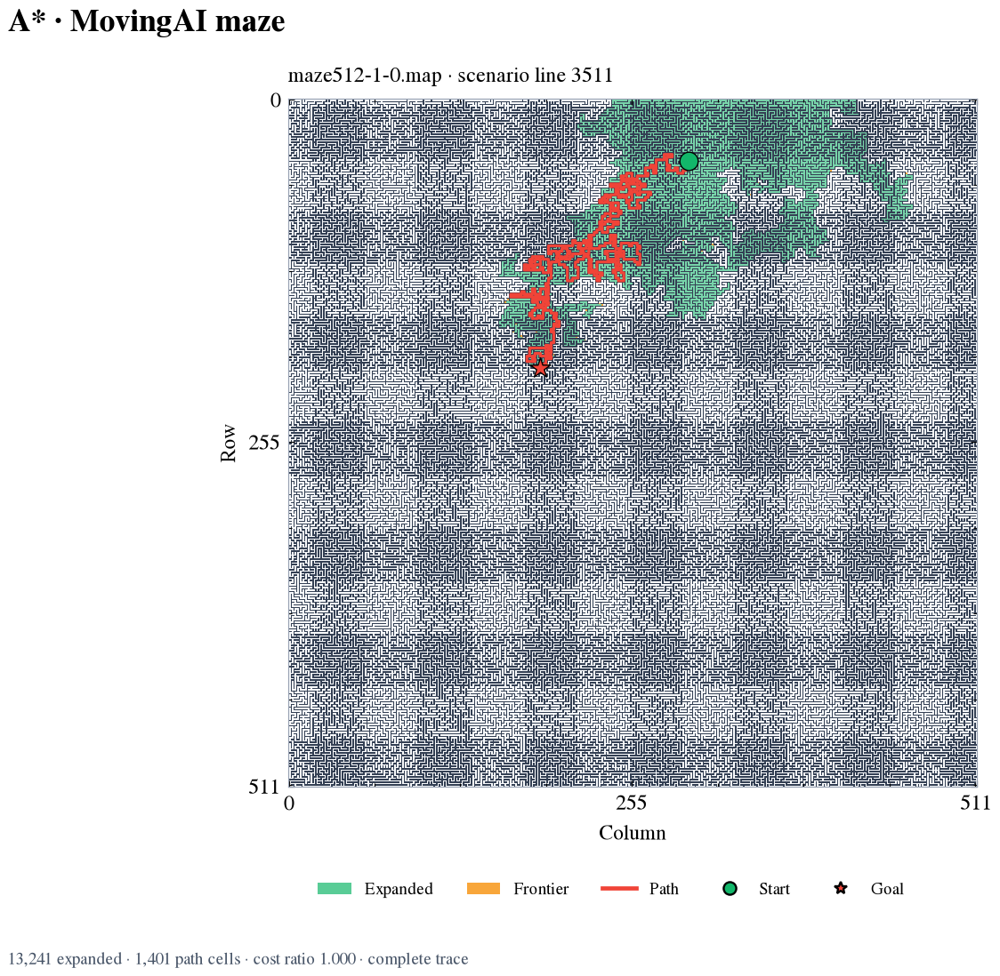
  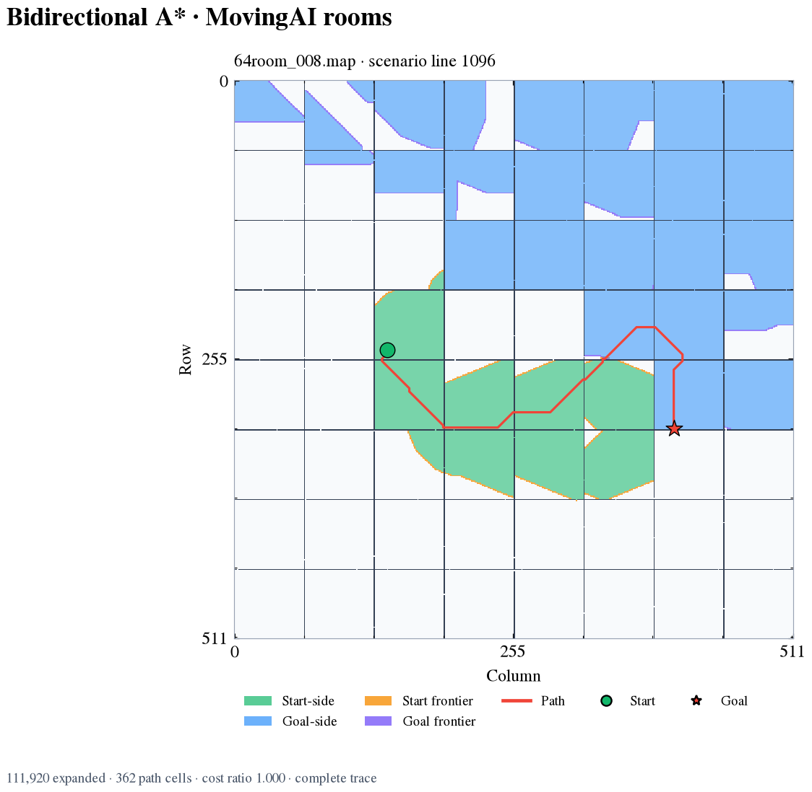
</p>
<p align="center">
  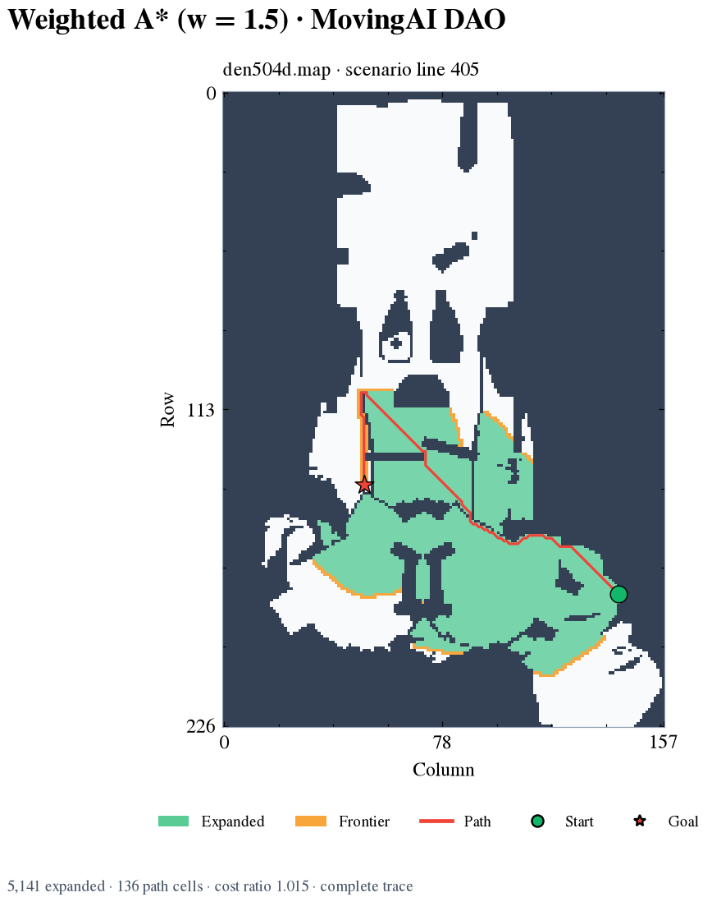
  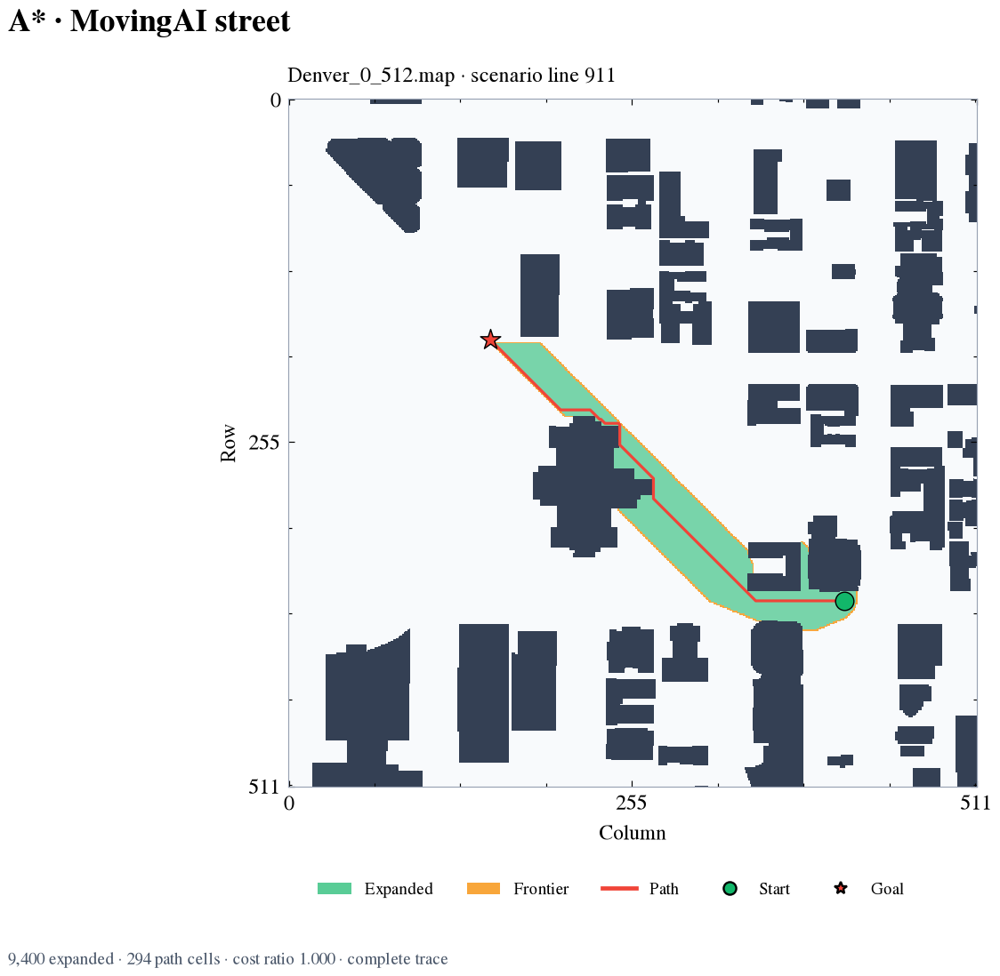
</p>
<p align="center">
  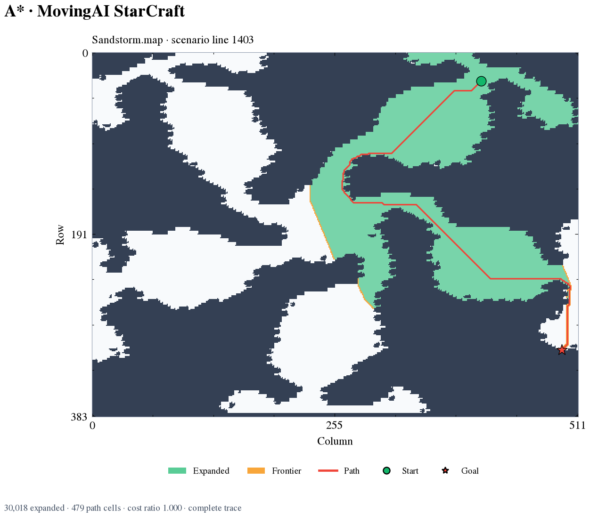
</p>

For interactive traces, custom scenes, and the rendering API, see the
[visualization guide](docs/visualization.md).

## Benchmark Datasets and Current Coverage

Results refreshed 2026-10-10. The benchmark suite contains unlike task models,
so each result stays within its dataset and movement-cost cohort. The gallery
below uses local source assets to show those differences; the views use
different scales and are not a representative sample or a measure of difficulty.

<p align="center">
  
</p>

| Cohort | Completed coverage | Result and limit |
|---|---:|---|
| MovingAI land | 789 maps; 3,363 reachable work queries × 12 variants; separate latency (788 queries) and memory (30 queries) cohorts | All 40,356 work observations returned valid paths without runner errors. A separate 2,160-query unreachable cohort across 180 maps was correctly classified by all 12 variants. |
| MovingAI grid specialists | 788 map/query pairs × 4 planners | JPS was optimal on 788; D* Lite was optimal on 750 and resource-limited on 38; Theta* and Lazy Theta* returned valid any-angle paths on all 788. |
| Scaling | 1,600 work queries × 17 variants; separate latency (400 queries) and memory (80 queries) cohorts | All 17 variants solved 1,538 reachable queries and correctly classified 62 unreachable queries; size, density, and corridor-topology cohorts retain their own memberships. |
| DIMACS roads | 13 of 25 directed graphs × 13 variants | The selected cohort covers six distance, six travel-time, and one source-weight graph; the other 12 graphs exceed configured resource limits. Road costs and grid costs are not pooled. |
| MovingAI and Monash voxels | 2 distinct maps × 13 variants | 20 optimal and 6 valid suboptimal results under the strict 26-neighbor oracle; mirrors and resource-limited maps remain visible in inventory. |
| BARN | 300 worlds × 14 compatible planners | 2,673 returned paths passed source-geometry validation; 1,527 runs ended with `no_solution_found`. No invalid paths or planner errors. |
| OMPL.app and terrain | Installed and registered | OMPL requires its matching collision/state-space runtime; terrain remains unsupported while the original cost table is unavailable. |

The 2026-10-10 refresh recorded 216,535 measurement entries across the
MovingAI land, scaling, unreachable, grid-specialist, DIMACS, voxel, and BARN
cohorts, including warm-up runs and separate work, latency, and memory passes.
All 37 planner IDs in the [supported planner registry](SUPPORTED_ALGORITHMS.md)
have measured results: dataset-scale results where the source task matches,
and separately labeled smoke results for temporal, multi-agent, vehicle, and
other unsupported source-task contracts. Smoke-only references are excluded
from the 2026-10-10 refresh total. The tables below keep each task model and
measurement protocol separate instead of combining them into a ranking.
Timing observations in the refresh were collected on an Apple M2 Max running
macOS 27.0.1 and Python 3.14.8; interpret timings within that host and protocol.

<details>
<summary>MovingAI land and scaling results for all 17 search variants</summary>

The 2026-10-10 refresh covers 3,363 solvable MovingAI map/query pairs in the
work pass; all 12 variants returned valid paths on every pair, with no errors,
timeouts, or inconsistent results. The separate latency pass covers 788
solvable map/query identities, using two warm-ups and five measured repeats
per variant. Scaling work covers 1,538 solvable and 62 unreachable tasks; all
17 variants solved the 1,538 and classified all 62 unreachable tasks
correctly. Scaling latency covers 386 solvable identities from a separate
400-task cohort, also with two warm-ups and five measured repeats. The cost
ratios and latency percentiles below are descriptive aggregates over their
frozen cohorts, not universal planner ranks.

| Variant | MovingAI optimal / 3,363; mean cost ratio | MovingAI median / P95 ms | Scaling optimal / 1,538; mean cost ratio | Scaling median / P95 ms |
|---|---:|---:|---:|---:|
| `anytime_astar` | 3,363; 1.000 | 2.214 / 48.115 | 1,538; 1.000 | 5.502 / 89.723 |
| `astar` | 3,363; 1.000 | 1.374 / 19.965 | 1,538; 1.000 | 4.323 / 29.672 |
| `astar_halpha_0` | — | — | 1,538; 1.000 | 10.711 / 30.380 |
| `astar_halpha_0.25` | — | — | 1,538; 1.000 | 9.349 / 29.200 |
| `astar_halpha_0.5` | — | — | 1,538; 1.000 | 8.817 / 31.462 |
| `astar_halpha_0.75` | — | — | 1,538; 1.000 | 6.762 / 24.664 |
| `astar_halpha_1` | — | — | 1,538; 1.000 | 4.308 / 29.736 |
| `bidirectional_astar` | 3,363; 1.000 | 4.287 / 35.832 | 1,538; 1.000 | 13.114 / 43.055 |
| `bidirectional_dijkstra` | 3,363; 1.000 | 1.805 / 22.188 | 1,538; 1.000 | 10.679 / 25.411 |
| `breadth_first_search` (`bfs`) | 447; 1.077 | 0.503 / 6.503 | 169; 1.038 | 3.605 / 9.491 |
| `depth_first_search` (`dfs`) | 85; 48.753 | 1.094 / 8.952 | 1; 56.935 | 3.942 / 17.875 |
| `dijkstra` | 3,363; 1.000 | 1.841 / 26.555 | 1,538; 1.000 | 9.407 / 29.047 |
| `greedy_best_first` | 684; 1.165 | 0.675 / 4.286 | 248; 1.112 | 0.838 / 16.318 |
| `reexp_astar` | 3,363; 1.000 | 1.208 / 14.652 | 1,538; 1.000 | 3.371 / 23.672 |
| `weighted_astar` (`w=1.25`) | 1,098; 1.017 | 0.806 / 13.099 | 502; 1.025 | 0.945 / 24.451 |
| `weighted_astar` (`w=1.5`) | 962; 1.028 | 0.763 / 11.571 | 461; 1.039 | 0.902 / 24.817 |
| `weighted_astar` (`w=2`) | 883; 1.042 | 0.731 / 10.156 | 440; 1.055 | 0.868 / 24.877 |

The 17 scaling variants include five `astar_halpha_*` settings that were not
part of the 12-variant MovingAI work and latency passes. Latency is the
per-query median across repeats, then summarized by the median and P95 across
the eligible query identities. The 2,160-query MovingAI unreachable check
across 180 maps is a separate correctness cohort and is not included in these
latency figures.
</details>

<details>
<summary>Directed DIMACS and strict 26-neighbor voxel outcomes</summary>

Each of the 13 listed variants ran on 13 directed weighted graphs and two
distinct voxel maps (`Simple.3dmap` and `plant01.3dmap`). Cells show valid
paths / oracle-optimal paths. DIMACS includes six distance graphs, six travel
time graphs, and one source-weight graph. Twelve of the 25 source graphs were
resource-limited. Voxel optimality uses the strict 26-neighbor Euclidean
oracle; neither dataset's latency is pooled with grid or geometric workloads.

| Variant | DIMACS, n=13 | Voxels, n=2 |
|---|---:|---:|
| `anytime_astar` | 13 / 13 | 2 / 2 |
| `astar` | 13 / 13 | 2 / 2 |
| `bfs` | 13 / 0 | 2 / 0 |
| `bidirectional_astar` | 13 / 13 | 2 / 2 |
| `bidirectional_dijkstra` | 13 / 13 | 2 / 2 |
| `dfs` | 13 / 0 | 2 / 0 |
| `dijkstra` | 13 / 13 | 2 / 2 |
| `dstar_lite` | 13 / 13 | 2 / 2 |
| `greedy_best_first` | 13 / 0 | 2 / 0 |
| `reexp_astar` | 13 / 13 | 2 / 2 |
| `weighted_astar` (`w=1.25`) | 13 / 13 | 2 / 2 |
| `weighted_astar` (`w=1.5`) | 13 / 13 | 2 / 2 |
| `weighted_astar` (`w=2`) | 13 / 13 | 2 / 2 |

<small>Counts are valid / optimal, not runtime ranks. Parallel road arcs are
coalesced by minimum cost per ordered pair; a zero heuristic is used because
road-coordinate units are not assumed to match edge-cost units.</small>
</details>

<details>
<summary>MovingAI grid-specialist results</summary>

| Planner | Coverage | Result |
|---|---:|---|
| `jps` | 788 map/query pairs | 788/788 oracle-optimal paths |
| `dstar_lite` | 788 map/query pairs | 750 optimal; 38 resource-limited |
| `theta_star` | 788 map/query pairs | 788/788 valid any-angle paths; not scored against the grid-optimal cost |
| `lazy_theta_star` | 788 map/query pairs | 788/788 valid any-angle paths; not scored against the grid-optimal cost |

The MovingAI terrain assets remain outside these runs because the source
terrain cost table is missing; `jpsw` therefore has only the separate
10-workload smoke result below.
</details>

<details>
<summary>BARN point-robot XY results for all 14 compatible continuous planners</summary>

Each planner ran once on each of 300 derived static point-robot XY worlds.
The table gives returned source-geometry-valid paths / 300 and the median
public API time across the 300 worlds; a `no_solution_found` outcome is not
counted as a path. All 2,673 returned paths passed exact source-circle
validation, with zero invalid paths or runner errors. This cohort has no
independent continuous optimality oracle, so it supports path-validity and
completion analysis rather than optimality claims or a cross-planner speed
ranking. The source `.npy` paths remain provenance only; they are not XY paths
in the supplied world coordinates.

| Planner | Valid paths / 300 | Median API ms |
|---|---:|---:|
| `abit_star` | 0 | 0.710 |
| `ait_star` | 0 | 0.581 |
| `bit_star` | 0 | 0.592 |
| `eirm_star` | 293 | 2.726 |
| `eit_star` | 0 | 0.604 |
| `fcit_star` | 295 | 22.655 |
| `fmt_star` | 0 | 0.616 |
| `informed_rrt_star` | 300 | 28.247 |
| `lazy_prm` | 293 | 2.690 |
| `prm_star` | 294 | 192.799 |
| `rit_star` | 299 | 89.164 |
| `rrt` | 299 | 1.544 |
| `rrt_connect` | 300 | 0.571 |
| `rrt_star` | 300 | 23.268 |

`jit_star` is excluded from BARN because this point-robot model does not
provide the robot Jacobian required for manipulability scoring.
</details>

<details>
<summary>Smoke-only measurements for the remaining task contracts</summary>

These are one-run reference checks with fixed seeds and no warm-up, not
dataset-scale results or statistically stable rankings. Timing values across
different task contracts are not comparable.

| Planner | Result | Smoke workload |
|---|---|---|
| `jpsw` | 10/10 successful; 77.820 ms median API | 10-family MovingAI smoke; source terrain costs unavailable |
| `sipp` | 1/1; 0.146 ms; arrival 4, cost 4 | Temporal reference case |
| `bounded_suboptimal_sipp` | 1/1; 0.077 ms; arrival 4, cost 4 | Temporal reference case |
| `kinodynamic_sipp` | 1/1; 0.080 ms; arrival 6, cost 6 | Kinodynamic temporal reference case |
| `eecbs` | 1/1; 0.130 ms; sum of costs 4, makespan 2 | Multi-agent reference case |
| `lacam_star` | 1/1; 0.087 ms; sum of costs 4, makespan 2 | Multi-agent reference case |
| `hybrid_astar` | 1/1; 0.223 ms; cost 13.894 | Vehicle reference case |
| `state_lattice` | 1/1; 0.179 ms; cost 3 | Vehicle reference case |
| `jit_star` | 1/1; 492.546 ms; 45 nodes | Jacobian-enabled continuous reference case |

Temporal, multi-agent, and vehicle planners have no matching source tasks in
the installed static single-agent datasets. `jit_star` has a reference result,
but is not compatible with the BARN point-robot model.
</details>

For provenance, dataset exclusions, bias controls, and reproduction commands,
see the [dataset installation guide](docs/benchmarks/dataset_installation.md),
[dataset semantics and bias controls](docs/benchmarks/dataset_characterization.md),
and [campaign reproduction guide](docs/shortest_path_benchmark_reproduction.md).

## Full Benchmark Cohort Figures

These figures use the 2026-10-10 refreshed complete cohorts. They cover every
dataset-scale algorithm/dataset pairing that currently has a compatible
runner: MovingAI land, generated scaling
grids, grid specialists, DIMACS graph subtypes, both distinct voxel sources,
and BARN point-robot worlds. The format cohorts keep their own cost, movement,
and collision semantics; do not compare values across panels as one leaderboard.

The latency figures separate repeated public-API calls from one-call-per-query
results. Repeated cohorts show the median of five calls per query, then the
median and P95 across query identities; one-call cohorts show the spread across
source instances. A one-instance DIMACS or voxel panel is a case measurement,
not an estimate of performance across that dataset. Work and path-cost figures
use only the compatible 2D octile cohorts. The mean path-cost ratio uses a
logarithmic axis because DFS averages 48.8× and 56.9× the oracle cost on the two
cohorts; this keeps those outliers visible while preserving differences near
1.0. Outcome shares are calculated within each compatible cohort, and the
all-planner unreachable proof is reported as a separate completeness check.
For BARN, `no_solution_found` is a planner outcome and does not mean an invalid
returned path. Memory separates instrumented per-query workspace from total
fresh-worker RSS, which also includes Python, map loading, and graph setup.

<p align="center">
  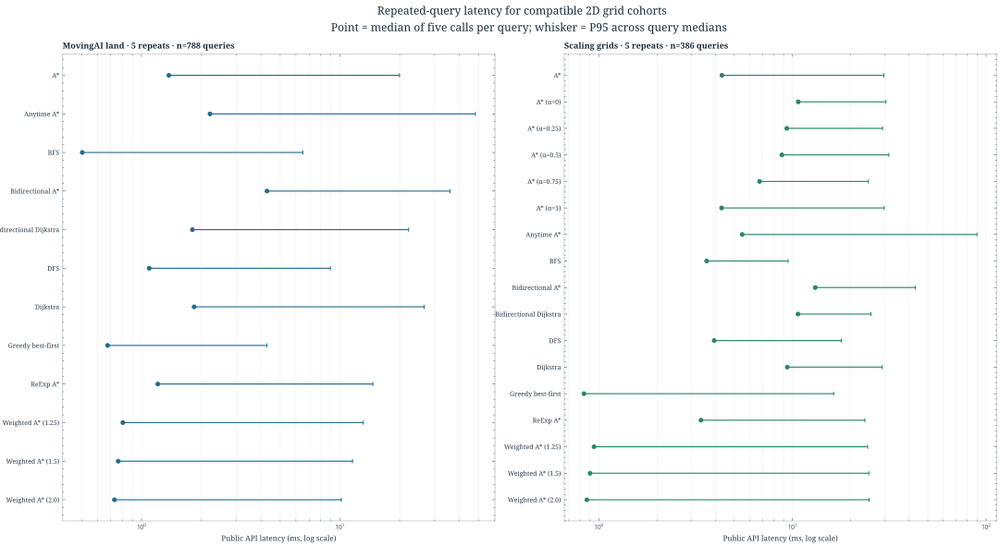
</p>
<p align="center">
  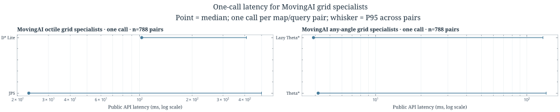
</p>
<p align="center">
  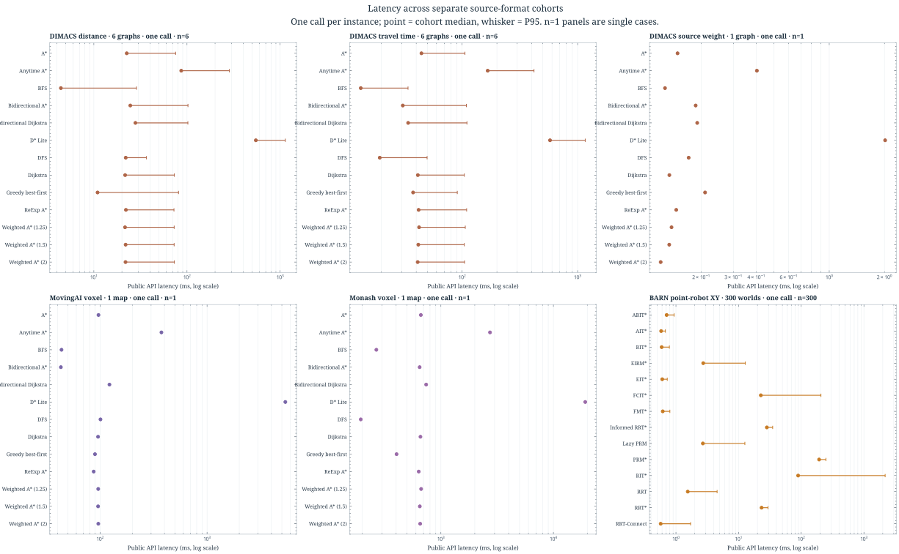
</p>
<p align="center">
  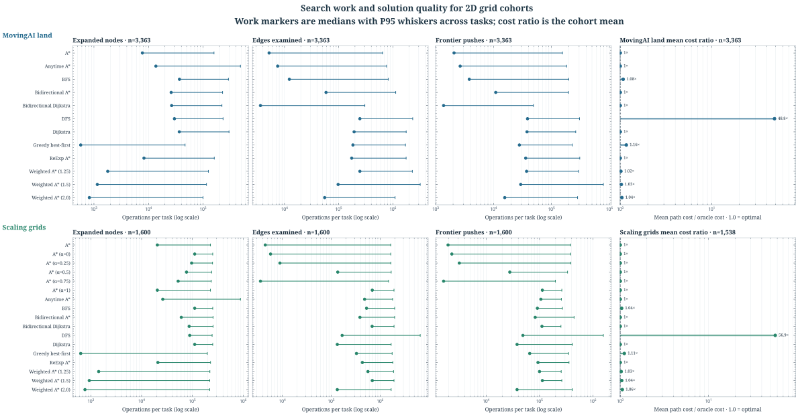
</p>
<p align="center">
  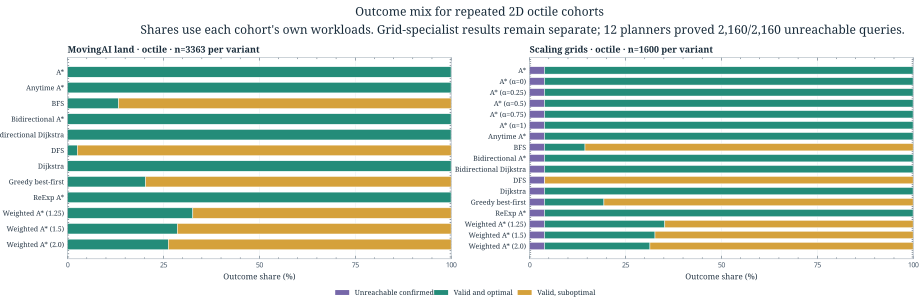
</p>
<p align="center">
  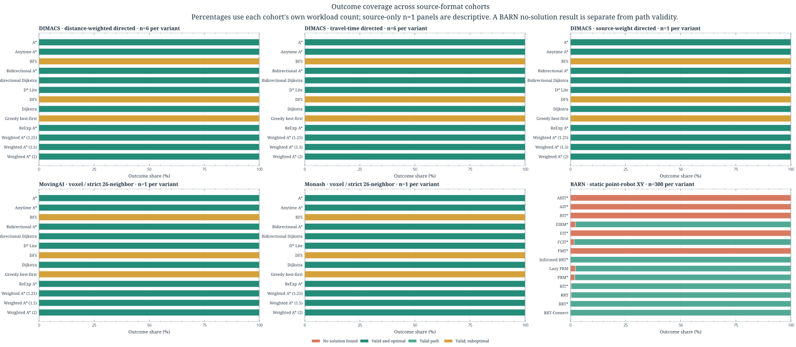
</p>
<p align="center">
  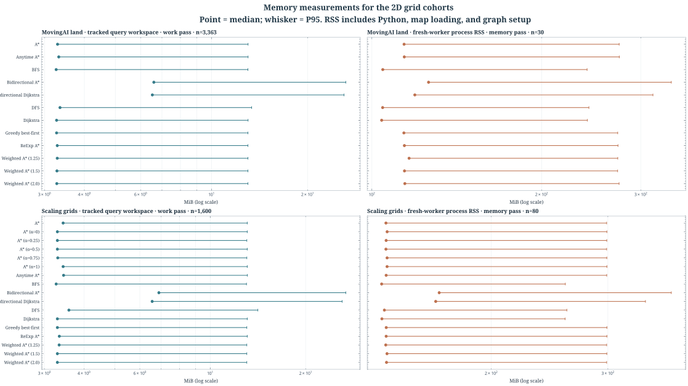
</p>

Terrain and OMPL remain unmeasured because the source terrain cost table and
matching OMPL collision/state-space runtime are unavailable. Temporal,
multi-agent, kinodynamic, and vehicle planners retain their separately labeled
smoke references because the installed static datasets do not contain matching
source tasks. The [reproduction guide](docs/shortest_path_benchmark_reproduction.md)
records the refresh commands and measurement boundaries.

## Installation

```bash
git clone https://github.com/damminhtien/pathplanning.git
cd pathplanning

python -m venv .venv
source .venv/bin/activate
pip install --upgrade pip
pip install .
```

Python `>=3.10`, a C11 compiler, and a C++17 compiler are required when building
from source. Graph search runs in C++; continuous planner kernels run in C.

## Package API

Minimal import-first usage:

```python
from pathplanning import RrtParams, plan_continuous
from pathplanning.core.contracts import ContinuousProblem, GoalState
from pathplanning.spaces.continuous_3d import ContinuousSpace3D

space = ContinuousSpace3D(lower_bound=[0, 0, 0], upper_bound=[10, 10, 10])
params = RrtParams(max_iters=2_000, step_size=0.6, goal_sample_rate=0.1)
problem = ContinuousProblem(
    space=space,
    start=[1.0, 1.0, 1.0],
    goal=GoalState(state=[9.0, 9.0, 1.0], radius=0.5, distance_fn=space.distance),
)

result = plan_continuous(
    problem,
    planner="rrt",
    params=params,
    seed=7,
)

print(result.success, result.stop_reason, result.path)
```

Single public API for both planner families:

```python
from pathplanning.api import plan_discrete
from pathplanning.core.contracts import DiscreteProblem
from pathplanning.spaces.grid2d import Grid2DSearchSpace

problem = DiscreteProblem(
    graph=Grid2DSearchSpace(),
    start=(5, 5),
    goal=(45, 25),
)
result = plan_discrete(problem, planner="astar", seed=0)
print(result.success, result.iters)
```

For inconsistent heuristics, `reexp_astar` exposes Weighted A* with conditional
closed-node re-expansion. Its parameters follow ReExpAstar: `weight`, `r`,
`r_mode` (`abs`, `rel_edge`, or `rel_g`), and `tie_break` (`g_low` or
`g_high`). `r=0` always reopens improved closed nodes; `r=float("inf")` never
reopens them. `max_runtime_ms` and `max_expansions` bound a search.

```python
result = plan_discrete(
    problem,
    planner="reexp_astar",
    params={"weight": 1.5, "r": 0.2, "r_mode": "abs"},
)
print(result.success, result.stats.get("reopens", 0.0))
```

For uniform-cost 8-connected occupancy grids with corner cutting disabled,
`jps` compresses straight and diagonal runs into jump-point expansions while
returning the full cell path. See the [JPS contract and runnable example](docs/algorithms/jps.md).

For weighted 8-connected terrain grids, `jpsw` applies Weighted Jump Point
Search to positive per-cell costs and returns the full traversed-cell path.
Construct a `TerrainCostGrid2D` to use its cardinal and diagonal cell-integral
cost model; see the [JPSW contract and runnable example](docs/algorithms/jpsw.md).

For any-angle paths on 8-connected grids, `theta_star` uses conservative line
of sight and returns cell waypoints joined by validated segments. See the
[Theta* contract and runnable example](docs/algorithms/theta_star.md).

`lazy_theta_star` delays shortcut visibility checks until the node is expanded
and repairs blocked shortcuts through a closed neighboring cell. It shares
Theta*'s conservative corner and terrain-cost rules; see the [Lazy Theta*
contract and runnable example](docs/algorithms/lazy_theta_star.md).

For a fixed goal in a graph whose directed edges can change cost, `dstar_lite`
keeps its search state across calls. Use `DStarLitePlanner` to move the start,
block or reopen existing edges, and repair the route; see the [D* Lite contract
and runnable example](docs/algorithms/dstar_lite.md).

For known time-varying node and edge blocks, `sipp` searches safe intervals
with continuous arrival times and waiting. Pass half-open blocked intervals to
`TemporalProblem`; see the [SIPP contract and runnable example](docs/algorithms/sipp.md).
Use `bounded_suboptimal_sipp` with `params={"w": 1.5}` to trade path optimality
for focal-search guidance while retaining the configured suboptimality bound;
see its [contract and example](docs/algorithms/bounded_suboptimal_sipp.md).
For velocity-state graphs that cannot stop instantaneously, use
`kinodynamic_sipp` with validated motion primitives and explicit speed and
acceleration limits; see its [contract and example](docs/algorithms/kinodynamic_sipp.md).

### Native graph input

Discrete searches run against a C++-owned CSR graph. For repeated queries or
large graphs, initialize it once and reuse it:

```python
from pathplanning.api import plan_discrete
from pathplanning.core.contracts import DiscreteProblem
from pathplanning.native import NativeGraph

graph = NativeGraph.from_edges(
    nodes=[0, 1, 2, 3],
    edges=[(0, 1, 1.0), (0, 2, 4.0), (1, 3, 2.0), (2, 3, 1.0)],
)
problem = DiscreteProblem(graph=graph, start=0, goal=3)
result = plan_discrete(problem, planner="astar")
```

For an exact point goal, the informed sampling planners can be selected through
the same API:

```python
from pathplanning.api import plan_continuous
from pathplanning.core.contracts import ContinuousProblem, GoalState
from pathplanning.spaces.continuous_3d import ContinuousSpace3D

space = ContinuousSpace3D(lower_bound=[0, 0, 0], upper_bound=[10, 10, 10])
problem = ContinuousProblem(
    space=space,
    start=[1.0, 1.0, 1.0],
    goal=GoalState(state=[9.0, 9.0, 1.0]),
    params={"sample_count": 1_000, "batch_size": 100},
)
result = plan_continuous(problem, planner="bit_star", seed=7)
```

`fmt_star`, `bit_star`, `abit_star`, and `informed_rrt_star` optimize additive
path length and reject custom objectives. `bidirectional_astar` requires an
exact goal and a consistent graph heuristic; its native kernel validates the
heuristic on the prepared graph before searching.

`ait_star` combines a reverse cost-to-go search with lazy forward edge
validation. It searches the fixed random geometric graph generated by
`sample_count`; it requires an exact point goal, Euclidean distance, and
additive path length. The [AIT* contract](docs/algorithms/ait_star.md) describes
its finite-graph behavior and guarantee limits.

`eit_star` adds a reverse estimate of collision-check effort and uses it to
break ties between equal path-cost estimates. It shares the fixed-graph and
objective constraints described in the [EIT* contract](docs/algorithms/eit_star.md).

`fcit_star` searches a fully connected informed sample graph with a distributed
edge queue and batched motion checks. It accepts an optional batch motion-check
callback for custom spaces and uses the scalar checker as a fallback; see the
[FCIT* contract](docs/algorithms/fcit_star.md).

`rit_star` optimizes Riemannian arc length under a positive-definite metric
tensor, with anisotropic neighborhoods, cascading edge-cost checks, and optional
CARM updates from collision feedback. Custom metric spaces declare global
eigenvalue bounds and opt into Python callbacks; see the [RIT* contract](docs/algorithms/rit_star.md).

`jit_star` adds bounded ancestor checks and collision-guided sampling to a
native RRT* tree. Robot spaces provide `jacobian(state)` to enable the
manipulability-aware objective and explicitly opt into Python callbacks; see
the [JIT* contract](docs/algorithms/jit_star.md).

`EirmStarRoadmap` keeps a sampled graph and edge-validation results for multiple
queries in one unchanged world. Its per-query search uses remaining collision
effort to break equal-cost path ties; see the [EIRM* contract](docs/algorithms/eirm_star.md).

For repeated continuous-space queries, `PrmStarRoadmap` retains its sampled
roadmap and validates candidate edges during construction. `LazyPrmRoadmap`
defers edge checks until they appear on a candidate route, then caches both
valid and blocked results. Both use `RoadmapParams` and require the caller to
change `world_version` when the world changes; see the [PRM*](docs/algorithms/prm_star.md)
and [Lazy PRM](docs/algorithms/lazy_prm.md) contracts and examples.

For bulk input, pass CSR row offsets, neighbor IDs, and edge costs to
`NativeGraph.from_csr`. This also accepts arrays from a SciPy CSR matrix through
its `indptr`, `indices`, and `data` attributes; SciPy is not required by the
native graph API. No NetworkX conversion is used.

Existing Python graphs that implement `neighbors` and `edge_cost` remain
supported. Their finite reachable graph is copied into CSR once before each
search. Goal predicates and heuristics are evaluated during that preparation;
the C++ search loop does not call Python. The default materialization limit is
1,000,000 nodes and can be changed with
`DiscreteProblem(params={"max_materialized_nodes": ...})`. Use `NativeGraph`
for graphs that exceed that limit or for repeated searches over the same graph.
The built-in 2D and 3D grids pass their valid-node mask and motion set to C++,
which builds their CSR adjacency without Python edge callbacks.

Discrete search results include `graph_init_s` and `native_search_s` stats, and
`elapsed_s` covers graph preparation, native search, and path adaptation. The
two canonical benchmark commands emit the versioned
`pathplanning_benchmark_v1` report with raw per-run observations, summaries,
seed/workload settings, source and native artifact fingerprints, and host
metadata. Use `--output path/to/report.json` to save it atomically or `--json`
to print it. Reports saved under `benchmark-results/` are excluded from source
fingerprints. See [the benchmark contract](docs/benchmark_contract.md) for the
schema and interpretation limits.

## Run Demos

Run from repository root.

```bash
python examples/worlds/custom_grid_world.py
python examples/worlds/demo_3d_world.py
python examples/eecbs.py
python examples/viewer_2d.py
python examples/viewer_3d.py
python scripts/benchmark_planners.py --output benchmark-results/planners.json
python scripts/benchmark_native_sampling.py --output benchmark-results/native-sampling.json
```

## Developer Workflow

Install dev dependencies:

```bash
pip install -r requirements-dev.txt
make build-ext
```

Run checks:

```bash
ruff check .
ruff format --check .
pyright
make test       # fast unit tier (excludes slow integration/packaging checks)
make test-slow  # slow integration/packaging tier
make test-all   # full suite
```

Convenience commands:

```bash
make install-dev
make lint
make typecheck
make test
```

## Typing Policy

Typing is enforced incrementally with `pyright`.

- Global mode: `basic`
- Strict subset:
  - `pathplanning/core`
  - `pathplanning/spaces/continuous_3d.py`
  - `pathplanning/spaces/continuous_nd.py`
  - `pathplanning/spaces/grid2d.py`
  - `pathplanning/nn/index.py`
  - `pathplanning/data_structures/tree_array.py`
  - `pathplanning/planners/sampling/rrt.py`
  - `pathplanning/planners/sampling/rrt_star.py`
  - `pathplanning/api.py`
  - `pathplanning/registry.py`

The package ships `pathplanning/py.typed` (PEP 561).

Details: `docs/typing_policy.md`

## CI

GitHub Actions workflow: `.github/workflows/pylint.yml`

Current CI jobs run:

- `ruff check ...` and `ruff format --check ...`
- `pyright`
- `pytest -q`

## License

See `LICENSE`.
