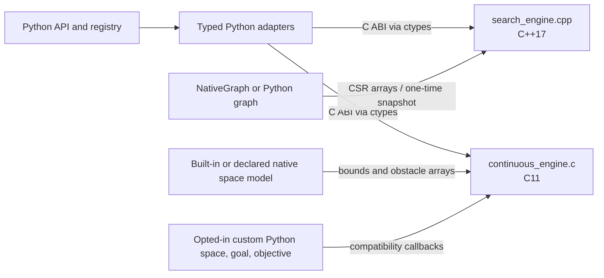

# Native Planning Core

This document describes where planner work runs, how Python data reaches the
native code, and how to build the two native libraries. The discrete graph
search implementation remains C++; the continuous sampling kernels are C.

## Architecture



### Discrete graph search

`pathplanning/native/search_engine.cpp` owns the native CSR graph representation,
search state, frontier queues, and generic search loops. The specialized JPS
kernel in `pathplanning/native/jps_grid.cpp` searches a row-major occupancy mask
directly, avoiding CSR construction for that planner. Both use the C ABI
declared in `search_engine.h` and called through `pathplanning/native/_ffi.py`.

`NativeGraph` stores reusable adjacency in CSR form. A Python graph implementing
the graph protocol is materialized into CSR before search; goal and heuristic
values are prepared before the C++ search loop starts. The loop does not call
Python. Built-in 2D and 3D grids provide their dimensions, motions, and valid
node masks to the native CSR builder. No NetworkX conversion is used.
JPS is restricted to uniform-cost, 8-connected `Grid2DSearchSpace` instances;
its adapter snapshots cell validity once and the C++ kernel enforces the
no-corner-cutting diagonal rule while jumping between search points.

Search state uses dense arrays by node ID for locality: an 8-byte path cost, a
4-byte parent ID when the graph fits in 32-bit IDs (otherwise 8 bytes), and a
1-byte flag. That is 13 or 17 bytes per node for these arrays, excluding the
graph, frontier, allocator overhead, and any prepared goal or heuristic data.
For a custom Python graph, the adapter evaluates its goal predicate and, when
needed, heuristic once per materialized node. Built-in grid graphs can compute
their Euclidean heuristic from dimensions during search and avoid a per-node
heuristic array.

### Continuous sampling planners

`pathplanning/native/continuous_engine.c` owns the expansion loops, node and
parent arrays, planner queues, collision sampling, and incremental nearest
neighbor index. The current C engine implements `rrt`, `rrt_star`,
`informed_rrt_star`, `fmt_star`, `bit_star`, `abit_star`, `rrt_connect`, and the
tree-pruning and growth operations used by `DynamicRRT3D`.

`pathplanning/native/continuous.py` is the Python FFI adapter. It validates and
converts inputs, keeps temporary native arrays alive during each call, invokes
the C ABI, and converts result arrays into the existing Python result types.
Public planner modules retain their Python API and delegate the search work to
this adapter.

For the built-in `ContinuousSpace3D` and `Grid2DSamplingSpace` types, bounds and
obstacle primitives are copied into contiguous arrays once per plan. A custom
space can implement `to_native_model()` and return
`NativeContinuousSpaceModel` with the same bounds and supported box, sphere, and
oriented-box primitives. The C engine then performs sampling, distance,
steering, state checks, motion checks, and search directly. Python subclasses
that override built-in behavior can provide their own native model.

Python callbacks are disabled by default. A custom Python space, goal predicate,
or supported RRT* objective that has no native representation requires
`RrtParams(allow_python_callbacks=True)`. This explicit compatibility path can
cross into Python during planning. The result stats report whether callbacks
were used and whether a native space model was supplied.

`DynamicRRT3D` keeps its existing Python-facing tree collections for callers,
while C performs pruning, nearest-node queries, edge checks, and growth. The
Python object serializes the current tree and rebuilds its public collections
from the returned arrays.

## Data Layout and Scale

- Discrete adjacency is stored as CSR (`O(V + E)`). Search state is a dense
  per-node allocation for locality; parent IDs use 32-bit storage when the
  graph fits, with 64-bit IDs for larger graphs.
- Continuous states and costs are held in contiguous native arrays. The
  nearest-neighbor index is an incremental KD forest, avoiding a Python object
  per node in the planner's inner loop.
- Tree node IDs are 32-bit in the continuous engine. Memory use therefore
  grows with the state dimension and node count; practical capacity is bounded
  by available memory before the ID limit on typical planning workloads.
- Native continuous calls currently accept dimensions from 1 through 1024.
  The built-in continuous spaces covered by the native model are 2D and 3D.

The planner API preserves generic Python space contracts. For callback-free
expansion, use a built-in native space or implement the
`NativeContinuousSpaceProvider` protocol and return a `NativeContinuousSpaceModel`.

## Building and Loading

Source builds require Python `>=3.10`, a C11 compiler, and a C++17 compiler.
`pip install .` builds all four extension libraries as part of package
installation. For a checkout, build them in place with:

```bash
make build-ext
```

The build creates production `_search_engine` and `_continuous_engine`, plus
`_search_trace_engine` and `_continuous_trace_engine` from the same source files.
The diagnostic variants compile with `PP_ENABLE_TRACE=1`; the production
variants omit trace code at compile time. All export C ABI functions and are
loaded with `ctypes`; Python does not
implement or dispatch individual expansion steps. `MANIFEST.in` includes the
`.c`, `.cpp`, and `.h` sources in source distributions.

If a library is missing or incompatible, rebuild with `make build-ext`. The
exact ABI versions, callback failure rules, and resource ownership contract
are documented in [Native ABI, ownership, and errors](native_abi.md). Changing
a C struct requires updating its matching `ctypes.Structure` in `_ffi.py` or
`continuous.py` and incrementing the corresponding ABI version in the same
change.

`TraceOptions` selects a diagnostic library for one planning run. Native code
records ordered events into a bounded buffer; Python copies them into
`PlanResult.trace` only after planning returns. Matplotlib and the viewer are
loaded later by explicit visualization calls. A `NativeGraph` is copied once
from a borrowed production CSR view into a diagnostic-owned graph handle;
diagnostic graph storage is outside the trace byte cap. See
[Visualization](visualization.md) for the viewer and migration guide.

## Algorithms and Objectives

The registry and its public callables are listed in
[`SUPPORTED_ALGORITHMS.md`](../SUPPORTED_ALGORITHMS.md). `DynamicRRT3D` is a
separate stateful API rather than a registry entry.

`rrt_star` accepts a custom path objective when Python callbacks are explicitly
enabled. The native engine evaluates that objective through the callback
interface when comparing parent and rewire candidates. `informed_rrt_star`,
`fmt_star`, `bit_star`, and `abit_star` require
an exact point goal, Euclidean distance, and additive path length; they reject
custom objectives because their bounds rely on those assumptions.

## Benchmark Scope

Both `scripts/benchmark_native_sampling.py` and
`scripts/benchmark_planners.py` emit the shared v1 report, including raw
measured and warm-up runs, seed and workload settings, environment and source
provenance, and explicit summary denominators. The 2026-10-02 native sampling
report predates that contract and remains summary-only historical evidence.
See [the benchmark contract](benchmark_contract.md). Its results are documented
in [`docs/benchmarks/native_sampling_2026-10-02.md`](benchmarks/native_sampling_2026-10-02.md).
The planner benchmark covers 2D A*, 2D RRT, and 3D weighted A*. Results
characterize these workloads; they are not a planner-wide speedup claim.
