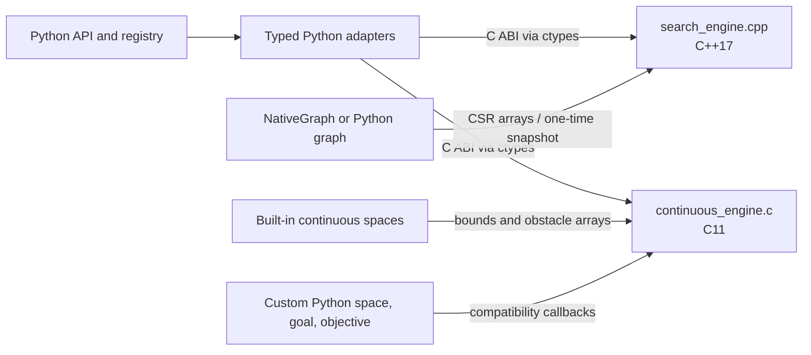

# Native Planning Core

This document describes where planner work runs, how Python data reaches the
native code, and how to build the two native libraries. The discrete graph
search implementation remains C++; the continuous sampling kernels are C.

## Architecture



### Discrete graph search

`pathplanning/native/search_engine.cpp` owns the native CSR graph representation,
search state, frontier queues, and search loops. Its public boundary is the C
ABI declared in `search_engine.h` and called through
`pathplanning/native/_ffi.py`.

`NativeGraph` stores reusable adjacency in CSR form. A Python graph implementing
the graph protocol is materialized into CSR before search; goal and heuristic
values are prepared before the C++ search loop starts. The loop does not call
Python. Built-in 2D and 3D grids provide their dimensions, motions, and valid
node masks to the native CSR builder. No NetworkX conversion is used.

Search state uses dense arrays by node ID for locality: an 8-byte path cost, a
4-byte parent ID when the graph fits in 32-bit IDs (otherwise 8 bytes), and a
1-byte flag. That is 13 or 17 bytes per node for these arrays, excluding the
graph, frontier, allocator overhead, and any prepared goal or heuristic data.
For a custom Python graph, the adapter evaluates its goal predicate and, when
needed, heuristic once per materialized node. Built-in grid graphs can compute
their Euclidean heuristic from dimensions during search and avoid a per-node
heuristic array.

### Continuous sampling planners

`pathplanning/native/continuous_engine.c` owns the expansion loops, node and
parent arrays, planner queues, collision sampling, and incremental nearest
neighbor index. The current C engine implements `rrt`, `rrt_star`,
`informed_rrt_star`, `fmt_star`, `bit_star`, `abit_star`, `rrt_connect`, and the
tree-pruning and growth operations used by `DynamicRRT3D`.

`pathplanning/native/continuous.py` is the Python FFI adapter. It validates and
converts inputs, keeps temporary native arrays alive during each call, invokes
the C ABI, and converts result arrays into the existing Python result types.
Public planner modules retain their Python API and delegate the search work to
this adapter.

For the built-in `ContinuousSpace3D` and `Grid2DSamplingSpace` types, bounds and
obstacle primitives are copied into contiguous arrays once per plan. The C
engine then performs sampling, distance, steering, state checks, and motion
checks directly. An arbitrary Python space, goal predicate, or supported RRT*
objective remains available through compatibility callbacks. Those custom
callbacks can cross into Python during planning; the built-in fast path avoids
that boundary in its expansion loop. Python subclasses that override built-in
behavior use the callback path as well.

`DynamicRRT3D` keeps its existing Python-facing tree collections for callers,
while C performs pruning, nearest-node queries, edge checks, and growth. The
Python object serializes the current tree and rebuilds its public collections
from the returned arrays.

## Data Layout and Scale

- Discrete adjacency is stored as CSR (`O(V + E)`). Search state is a dense
  per-node allocation for locality; parent IDs use 32-bit storage when the
  graph fits, with 64-bit IDs for larger graphs.
- Continuous states and costs are held in contiguous native arrays. The
  nearest-neighbor index is an incremental KD forest, avoiding a Python object
  per node in the planner's inner loop.
- Tree node IDs are 32-bit in the continuous engine. Memory use therefore
  grows with the state dimension and node count; practical capacity is bounded
  by available memory before the ID limit on typical planning workloads.
- Native continuous calls currently accept dimensions from 1 through 1024.
  The built-in continuous spaces covered by the native model are 2D and 3D.

The planner API preserves generic Python space contracts. Native execution does
not make arbitrary Python callbacks native: callers who need callback-free
expansion should use a built-in native space or provide a future native space
model through the C ABI.

## Building and Loading

Source builds require Python `>=3.10`, a C11 compiler, and a C++17 compiler.
`pip install .` builds both extension libraries as part of package
installation. For a checkout, build them in place with:

```bash
make build-ext
```

The build creates `_search_engine` from `search_engine.cpp` and
`_continuous_engine` from `continuous_engine.c`, with separate compiler flags.
Both export C ABI functions and are loaded with `ctypes`; Python does not
implement or dispatch individual expansion steps. `MANIFEST.in` includes the
`.c`, `.cpp`, and `.h` sources in source distributions.

If a library is missing or its ABI is stale, rebuild with `make build-ext`.
Changing a C struct requires updating its matching `ctypes.Structure` in
`_ffi.py` or `continuous.py` in the same change. Native allocations must be
released by their matching result-free function.

## Algorithms and Objectives

The registry and its public callables are listed in
[`SUPPORTED_ALGORITHMS.md`](../SUPPORTED_ALGORITHMS.md). `DynamicRRT3D` is a
separate stateful API rather than a registry entry.

`rrt_star` accepts a custom path objective. The native engine evaluates that
objective through the callback interface when comparing parent and rewire
candidates. `informed_rrt_star`, `fmt_star`, `bit_star`, and `abit_star` require
an exact point goal, Euclidean distance, and additive path length; they reject
custom objectives because their bounds rely on those assumptions.

## Benchmark Scope

`scripts/benchmark_planners.py` runs representative 2D A*, 2D RRT, and 3D
weighted A* cases. It reports end-to-end runtime for every row. The discrete
search rows also report graph initialization and native search times; the
sampling row currently has no separate C-kernel timer. The script's timings are
not a planner-wide performance claim. Compare repeated runs on the same host,
and include the full Python API path when measuring application latency.
