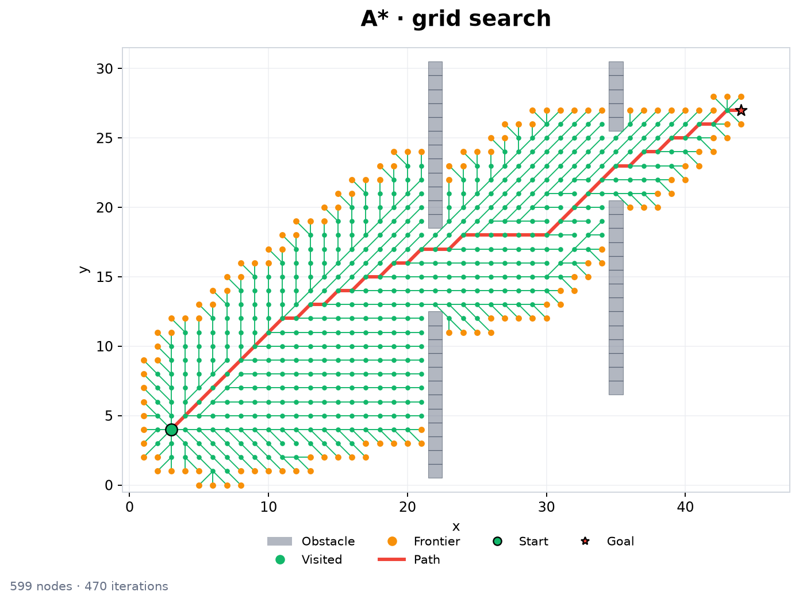
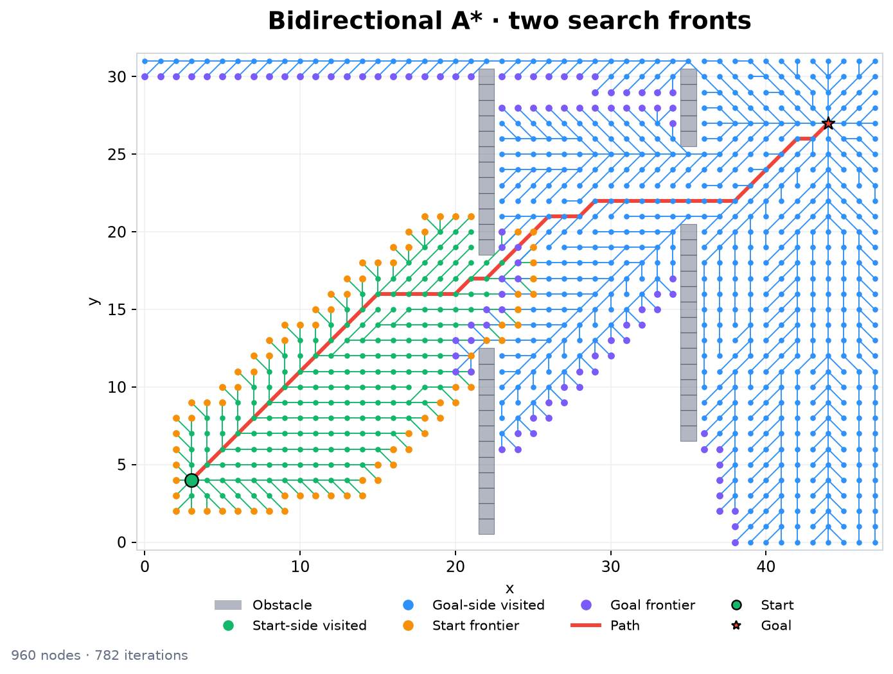
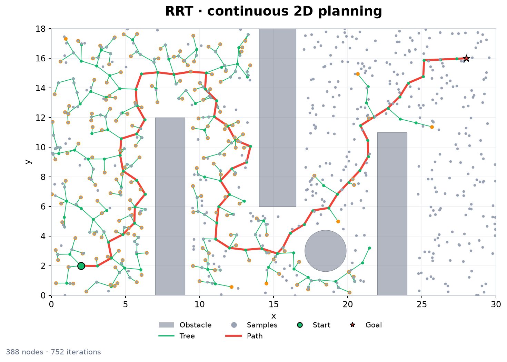
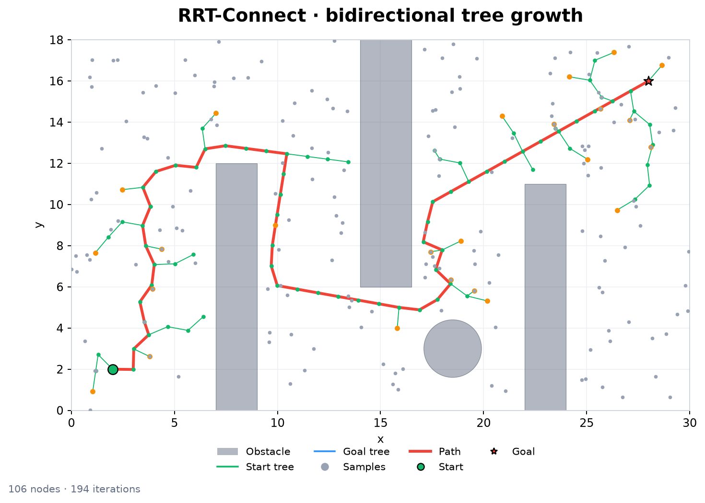
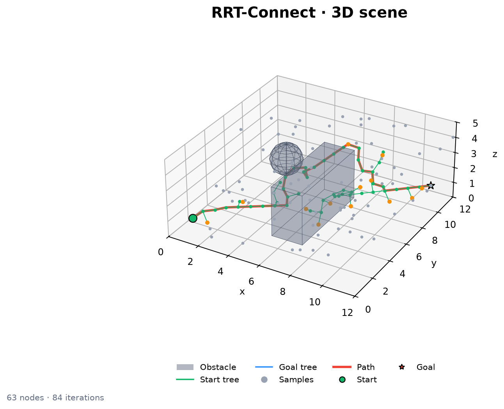

# Visualization

Visualization runs after a planner returns. Ordinary planning leaves tracing
off and does not load Matplotlib or the diagnostic native libraries.

Install the optional renderer and build the native extensions:

```bash
pip install -e '.[viz]'
make build-ext
```

## Static figures

```python
from pathplanning.api import plan_discrete
from pathplanning.core.contracts import DiscreteProblem
from pathplanning.spaces import Grid2DSearchSpace
from pathplanning.viz import render_result, scene_from_problem

problem = DiscreteProblem(Grid2DSearchSpace(width=40, height=30), (2, 2), (35, 25))
result = plan_discrete(problem, planner="astar")
renderer = render_result(scene_from_problem(problem), result)
renderer.save("path.png")  # .png, .svg, and .pdf
```

`render_result` returns a renderer that owns its figure and axes. Pass `ax=`
to draw into an existing axes. Multiple renderers can be used independently.
If planning failed or the trace ended early, the available final path remains
visible; a missing path simply leaves the path layer empty.

## Example renders

These figures use the current scene renderer and snapshots from completed
diagnostic traces. The final route stays visible while search state is replayed.
Regenerate the checked-in images after building the diagnostic libraries with
`python scripts/generate_visualization_assets.py`.

### 2D grid search





### 2D and 3D sampling







## Trace playback

```python
from pathplanning import TraceOptions
from pathplanning.api import plan_discrete
from pathplanning.viz import scene_from_problem, view_result

result = plan_discrete(problem, planner="astar", trace=TraceOptions())
viewer = view_result(scene_from_problem(problem), result)
viewer.show(block=True)
```

The viewer has play/pause, one-event steps, a seek slider, events-per-frame
speed, and layer switches for obstacles, samples, visited nodes, frontier,
tree, and final path. Space pauses, left/right arrows step, and Escape closes
the window. Seeking backwards reconstructs state from the event log with a
bounded checkpoint cache. A truncated trace replays only its recorded prefix;
the completed plan remains shown as a separate path layer.

For 2D and 3D working examples, run `python examples/viewer_2d.py` and
`python examples/viewer_3d.py`.

Recording requires the diagnostic native libraries. `TraceOptions(max_bytes=...)`
bounds native trace event, coordinate, and node-map storage for one run; the returned
`result.trace` owns copied NumPy arrays. Its `truncated` flag reports a full
buffer, and `graph_bytes` reports the diagnostic graph's struct and allocated
CSR-vector capacities separately from the trace cap (allocator bookkeeping is
not included).
Tracing has separate time and memory costs. Benchmarks of planner performance
should call planning without `trace`.

## Custom scenes and graph labels

`scene_from_problem` snapshots built-in grid and continuous spaces. It does
not invoke graph neighbors, collision checks, or user callbacks. Custom spaces
provide a `Scene` directly:

```python
import numpy as np
from pathplanning.viz import Circle, Scene, view_result

scene = Scene(
    bounds=np.array([[0.0, 0.0], [20.0, 15.0]]),
    start=np.array([1.0, 1.0]),
    goal=np.array([18.0, 12.0]),
    obstacles=(Circle(6.0, 7.0, 2.0),),
)
viewer = view_result(scene, result)
```

For discrete graphs whose labels are not 2D or 3D coordinates, pass
`positions={label: (x, y)}` (or 3D coordinates) to `view_result`. This mapping
is only used for display after planning. A grid with a custom blocked-cell
callback also needs an explicit scene so visualization does not secretly
scan every node through that callback. `NativeGraph.from_grid()` supplies grid
bounds but does not retain obstacle geometry; provide an explicit scene to
display blocked cells in that case.

## Migration from plotting modules

Replace `search2d_plotting.Plotting` and `sampling2d_plotting.Plotting` with
`scene_from_problem`, `render_result`, or `view_result`. Replace the old 3D
`render_tree_state` and `visualization` helpers the same way. Build the scene
from the actual problem instead of a second default environment. Existing
curve demos can continue using `geometry_draw.Arrow` and `Car`; pass `ax=`
when drawing into a specific figure.
